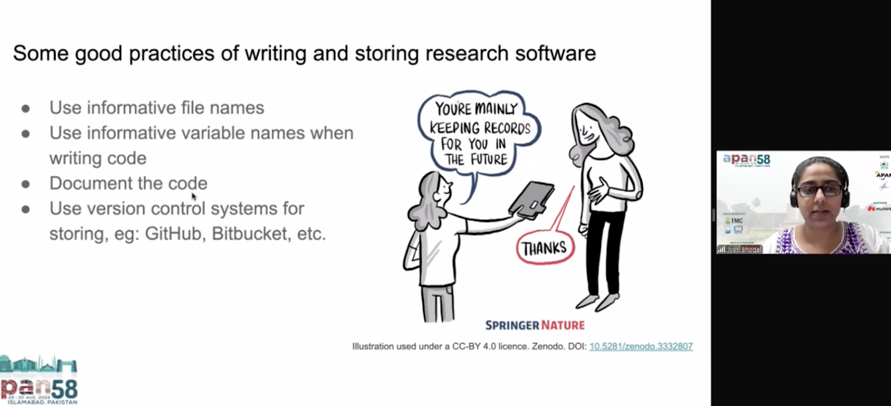
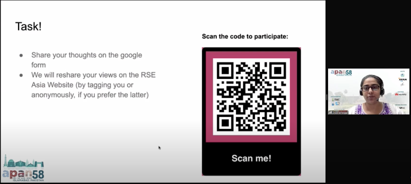

```{r setup, include=FALSE}
knitr::opts_chunk$set(echo = FALSE,
                      out.width = "100%",
                      out.extra="style='border:1px solid black;'")

```

 on [Unsplash](https://unsplash.com/photos/mount-fuji-japan-N4DbvTUDikw?utm_content=creditCopyText&utm_medium=referral&utm_source=unsplash)](david-edelstein-N4DbvTUDikw-unsplash.jpg)  
  


**What is the Asia-Pacific Advanced Network (APAN)?**  
APAN is the international partnership of the National Research and Education Networks (NRENs) across the region. It spans over half of the world’s population, and its members are fundamental in the provision of high-speed network connectivity domestically and globally.

APAN has a number of working groups, one of which is the Open and Sharing Data Working Group (OSDWG). I started to participate in this working group based on the common interest around the development of the research software community and its importance in the research ecosystem.  
   
During my talks at the APAN58 and APAN59 meetings, I had a chance to have interesting conversations and feedback, which I am sharing through this blog.

  

*Source:* [APAN58 : Asia Pacific Open and Sharing Data WG, 27th August 2024, Part 1](https://www.youtube.com/watch?v=giTd8lN88KQ) 

In August 2024, I had the opportunity to speak at the **Asia Pacific Advanced Network’s APAN58 meeting** online remotely. My presentation was on the title ***‘What is Research Software and Why Should we Think About its Sustainability?’*** as part of the Open and Sharing Data Working Group (OSDWG). My talk highlighted the importance of Research Software in the research ecosystem, thus explaining why it is necessary to think about its sustainability. I also shared about methods, tools, and best practices that can be deployed to achieve the same, following up with the need and the benefits to include techniques for reproducibility in Research Software. The talk also highlighted to the audience the usage of research software, who uses it, and what software tools can be used to create, maintain, and share research software such as Zenodo, GitHub, GitLab, and so on. I spoke about the different types of licenses that can be attached to the outputs of the research. This was followed by a summary of the journey of the [Research Software Engineering (RSE) Asia Association](https://rse-asia.github.io/RSE_Asia/), which I co-lead since its launch in 2021\.

🔑 **Talk Resources:** 

1. Presentation slides: Jyoti Bhogal. (2024, August 27). What is Research Software and Why Should we Think About its Sustainability?. Zenodo. [https://doi.org/10.5281/zenodo.13377699](https://doi.org/10.5281/zenodo.13377699)   

2. Talk recording (clip from 00:00 to 14:55) 
<iframe width="560" height="315" src="https://www.youtube.com/embed/giTd8lN88KQ?si=7P9Tu7Kj90rscXgm&amp;start=1" title="YouTube video player" frameborder="0" allow="accelerometer; autoplay; clipboard-write; encrypted-media; gyroscope; picture-in-picture; web-share" referrerpolicy="strict-origin-when-cross-origin" allowfullscreen></iframe>

As I spoke about research software, its definition, the tools to write and maintain it, the audience became curious to know more about research software and the community around it. For the OSDWG session, which focused on topics like Open Science and how research software complements it, my presentation actually gave a keynote kind of a head start to the rest of the talks being presented in the session of OSDWG. 


*Source*: [APAN58 : Asia Pacific Open and Sharing Data WG, 27th August 2024, Part 1](https://www.youtube.com/watch?v=giTd8lN88KQ) 

At the end of the talk, I engaged with the audience by asking them their thoughts about what they learnt about research softwaring engineering, by running a quick quiz with the audience. Some of the interesting anonymous responses to the question ‘What do you think about research software engineering as a role and as a career path?’ were

> “Looks interesting since I have heard about it for the very first time in this talk at APAN58 meeting.”

> “It is necessary for research software engineering management. I heard that the company do not have enough > capacity for managing research software engineers. But they need software consistently. So, the public sectors > help with this.”

For the question ‘What are your thoughts on how open science might help the researchers worldwide?’, some of the interesting anonymous responses were:

> “It's an innovative way to share research, data and publications, etc.”  

> “So many students in the world have a very different situation in their social and life environment. For them, the internet and open science involving open access, open data, open software, and so on will help provide an education and research environment for equality.”

It was enjoyable for me to read back the thoughts of the audience.

Apart from this, the various topics discussed at APAN58 ranged from cybersecurity, high-performance computing & AI, Agriculture & Rural Hybridization, Network Technologies, Telemedicine and research collaborations. These sessions gave me more insights into the latest proceedings in the various fields of research and development.

In March 2025, I had the opportunity to speak at the **Asia Pacific Advanced Network’s APAN59 meeting** online remotely. My presentation was on the title ***‘Building Bridges: Advancing Research Software Engineering and Open Science in Asia’***. I gave my talk as part of the APAN’s Open and Sharing Data Working Group (OSDWG). Software being one of the pillars of Open Science, through this talk, I highlighted how paying attention towards developing and maintaining research software is directly linked to the principles of Open Science.

During my talk, I spoke about my ongoing **Research Study on the Research Software Engineering (RSEng) Landscape in Asia**. I spoke about the necessity of this study since there is **no/low representation of the community of researchers who code in the Asian region**. This is rather clear from the maps of the outcomes of the existing SSI survey of the community of research software engineers in the different parts of the world.


Source: Article by SSI: [What do we know about RSEs? Results from our international surveys](https://www.software.ac.uk/blog/what-do-we-know-about-rses-results-our-international-surveys).  

  

Source: Article by SSI: [What do we know about RSEs? Results from our international surveys](https://www.software.ac.uk/blog/what-do-we-know-about-rses-results-our-international-surveys).

I shared about the roadmap of the project with the audience and some of the expected outcomes.

At the end of the talk, there were quite a few engaging questions. One of the comments from an active member of the APAN biannual meetings stated

>“The topic of this research study is something that deals with a national-level problem, thus making it much more essential to be studied.”

This fills me with more enthusiasm about taking the study further and coming up with insights in due course of time.

🔑**Talk Resources:**

1. Bhogal, J. (2025, March 3). Building Bridges: Advancing Research Software Engineering and Open Science in Asia. Zenodo. [https://doi.org/10.5281/zenodo.15180196](https://doi.org/10.5281/zenodo.15180196)   


## Get In Touch:

**Email:** [bhogaljyoti1@gmail.com](mailto:bhogaljyoti1@gmail.com)   
**LinkedIn:** [http://www.linkedin.com/in/jyoti-bhogal](http://www.linkedin.com/in/jyoti-bhogal)  
**GitHub:** [https://github.com/jyoti-bhogal](https://github.com/jyoti-bhogal)   
**Website:** [https://jyoti-bhogal.github.io/about-me/index.html](https://jyoti-bhogal.github.io/about-me/index.html) 

**Mastodon:** [jyoti_bhogal](https://mastodon.social/@jyoti_bhogal)
**Bluesky:** [jyoti-bhogal.bsky.social](https://bsky.app/profile/jyoti-bhogal.bsky.social)


