```{r setup, include=FALSE}
knitr::opts_chunk$set(echo = FALSE,
                      out.width = "100%",
                      out.extra="style='border:1px solid black;'")

```

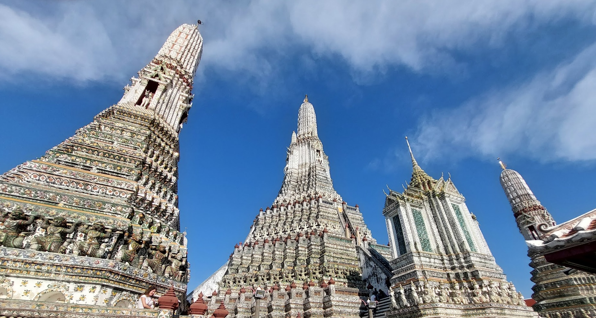

***Swa-dee-kah Bangkok\! 👋🙏***

## 🧑‍💻 What is FOSS?

FOSS, an acronym for Free and Open Source Software, embodies a software development philosophy centered on freedom and openness. The term 'Free' denotes users' liberty to run, alter, and share the software, while 'Open Source' signifies that the software's source code is available for users to inspect, modify, and contribute to its progress. FOSS promotes collaboration, transparency, and user empowerment. This frequently leads to the creation of more secure and sustainable software projects. Notable examples of FOSS include Linux, Blender, Chromium, Kubernetes, and Mozilla Firefox, among many more.

## 🧑‍💻🌏 What is FOSSASIA? 

FOSSASIA is an organisation developing Open Source software applications and Open Hardware together with a global community from its base in Asia. It is their goal to provide access to open technologies, science applications and knowledge that improve people's lives. They want to enable people to adapt and change technology according to their own ideas and needs and validate science and knowledge through an Open Access approach. FOSSASIA was established in 2009 by [Hong Phuc Dang](https://www.linkedin.com/in/hongphucdang/) and [Mario Behling](https://www.linkedin.com/in/mariobehling/). They organise and participate in conferences, meetups and code camps. The annual FOSSASIA Summit is one of the top tech events in Asia. Other summits take place in Vietnam, Cambodia, Thailand and India. FOSSASIA also runs a number of coding programs, such as Codeheat.

The FOSSASIA Summit 2025 was organised at True Digital Park, Bangkok, Thailand from 13th to 15th March 2025\.  It brought together numerous talks on topics around Free and Open Source Software. The Summit had multiple parallel track sessions like talks, lightning talks, workshops, and more\! There were booths by various organisations creating and/or using Free and Open Source Software. 

Being an SSI Fellow 2025, I was encouraged to attend it to understand the software landscape of Asia even better. I got a chance to attend various interesting talks and interact with people from various booths.

 

## 🗓️ Day 1

The day started with a lot of fervour. Following the welcome session by Hong Phuc Dang, there were multiple parallel tracks of talks.  

One of the booths displayed this robot. It is helpful at schools, colleges, and universities to provide an educational platform to learn from. I learnt how the robot senses one's presence and moves in the direction to face the person, as long as one is in its range of sensing. 

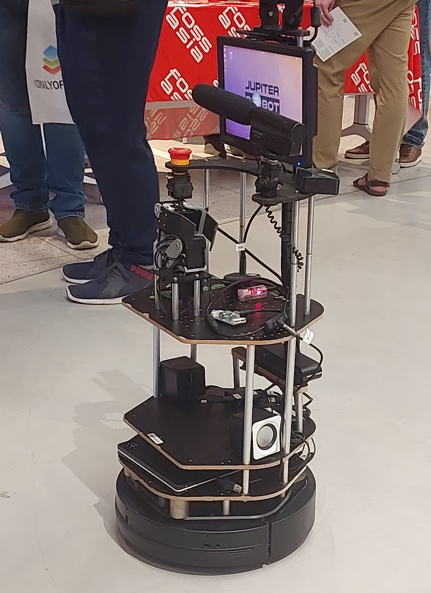

I had a chance to speak to a representative from the A11y accessibility labs, Nancy. I learnt about the various hardware like computer mouse, keyboards, eyeglasses, and gloves, used during accessibility training, to tools help people understand the difficulties that a person with a disability might face while using computers and software.

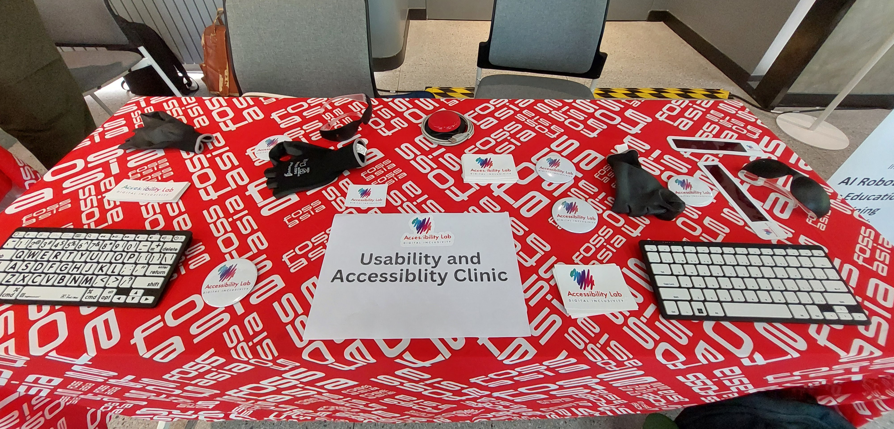

## 🗓️ Day 2

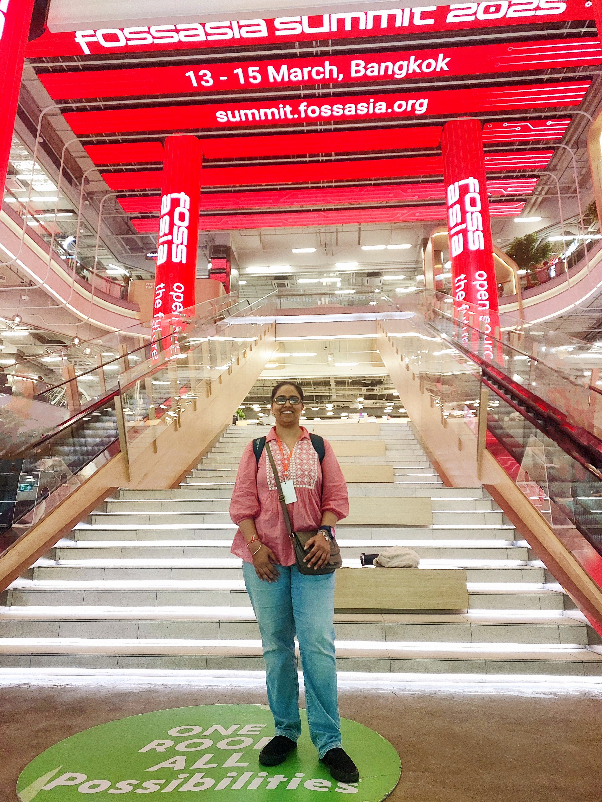

On 14th March, PGDay 2025, a 1-day event focused on the PostgreSQL database, was held in conjunction with the FOSSASIA Summit. I learnt about a new tool \- pgroll. pgroll is an open-source command-line tool designed for PostgreSQL, ensuring that schema updates are applied safely, without locking the database, and enabling multiple schema versions to coexist. This ensures uninterrupted operation for client applications during migration, even when introducing breaking changes. The tool’s capability to automatically backfill columns and support instant rollbacks further enhances its reliability.

I came across the booth of Grafana Labs. As I spoke to Richard Hartmann, from the Office of the CTO, he explained about the really useful features of Grafana Labs tools for creating reports, metrics, and graphs about the code being written.

FOSSASIA Summit 2025 was especially close to my heart because, apart from the spirit of the open source community to contribute back to the software that we knowingly or unknowingly consume, this was was a fabulous opportunity to speak with fellow Software/Developer Community Managers and learn the best Community Management practices from their lived experiences. 

🔑 Here are some of the best practices tips that come from my live interactions about community management:

1. To sharpen one's communication skills.  
2. To know the pain points of the researchers and programmers. Also, to communicate them back to the person/team which is performing the research or developing the software program.  
3. To flexibly use one's communication skills and software program writing skills, and find a good balance between both. 

## 🗓️ Day 3

I held a ‘***Meet & Greet Spot***’ to speak to people about the field of Research Software Engineering, and discussed how it is a career path where one can combine their interest in implementing their research skills along with programming skills. I also shared about the past and the upcoming activities of the Research Software Engineering (RSE) Asia Association. Most people were curious to learn more about it, and also expressed a desire to join the future events held for the community.


One key point I learned at the Summit — and something every software user and developer should know — is that the value of Free and Open Source Software is estimated at a whopping USD 8.8 million\!

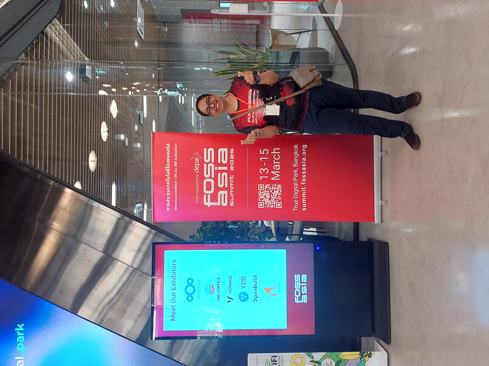


## 👥 Cultural Warmth

From the moment I arrived at Suvarnabhumi airport, I found everyone to be warm and welcoming. People at helpdesks, metro ticket counters, and even local markets were kind and helped me get around the city easily. I also learned something new about Thailand — it's a pedestrian-first country, where vehicles stop to let people cross the road. Another thing I noticed was a good gender balance in the different workplaces I came across.

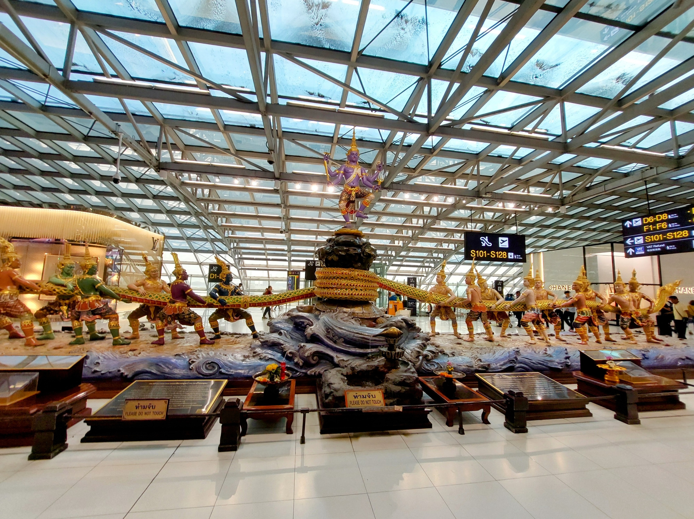

With fresh fruits like mangoes, jackfruits, bananas, guavas,cashews, and coconuts I truly experienced the tropical feel of the country. I enjoyed trying different types of bread, like red bean and almond bread. I also got to taste authentic Pad Thai noodles and Veg Thai Curry at a restaurant in True Digital Park. One kind conference attendee even taught me how to use chopsticks practically. I found Bangkok’s infrastructure very supportive for growth, with great workspaces and plenty of learning resources to help you make your own impact. Everyone I met — from the conference team to the hotel staff — was friendly and helpful, making the city feel not just a business hub, but a place that warmly welcomes you again and again.

Here’s a glimpse of Bangkok through my eyes\!


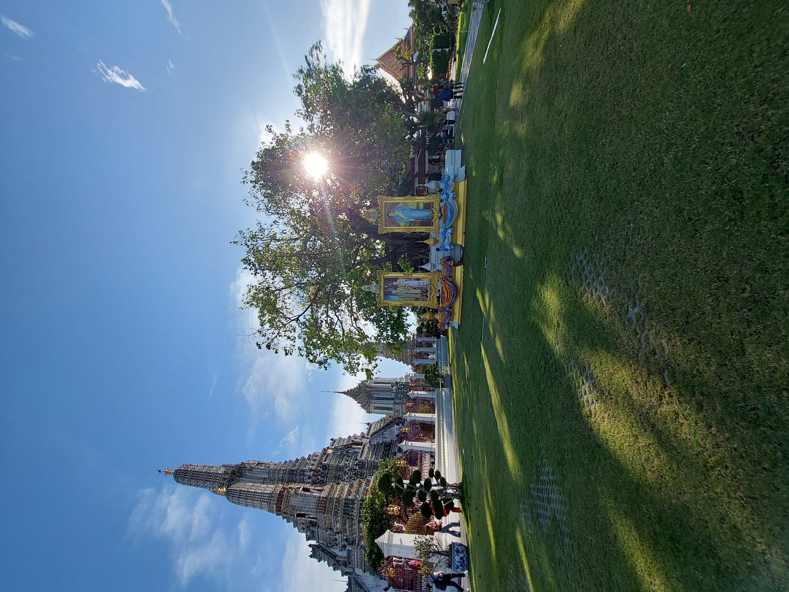

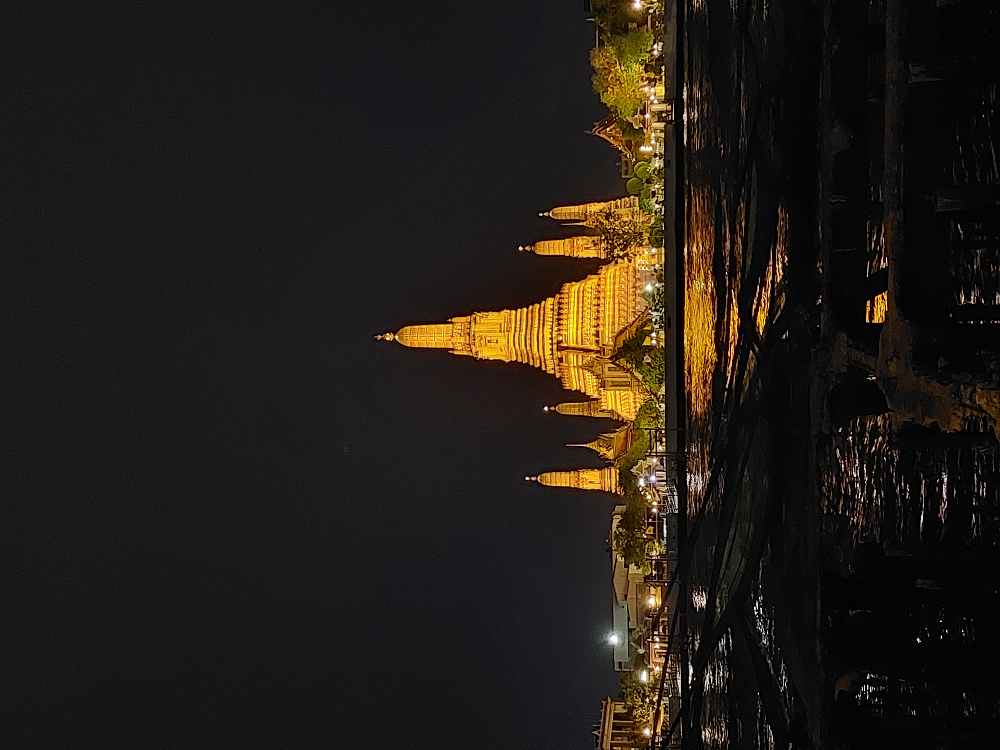

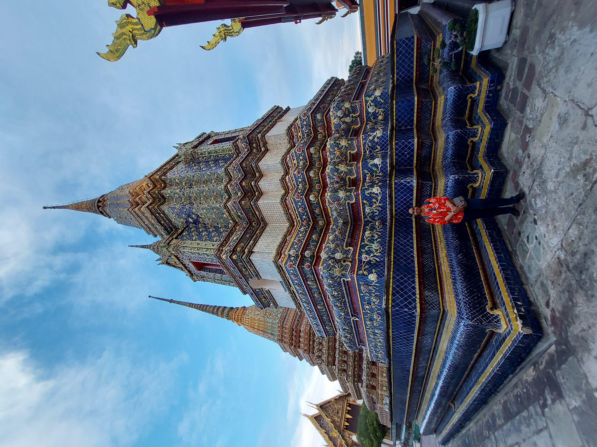

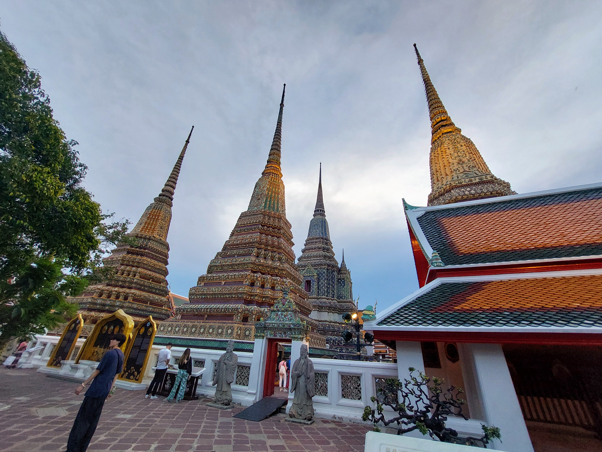

## 📕 Conclusion & Reflection

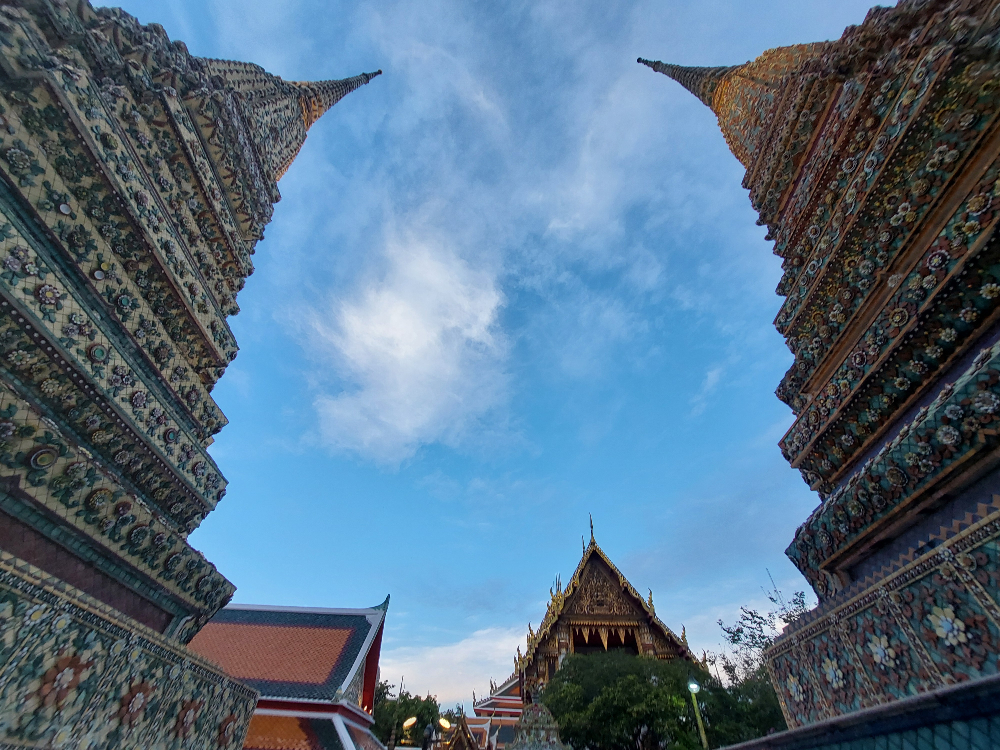

FOSSASIA Summit 2025 was especially close to my heart because it rekindled in me the spirit of the open source community to contribute back to the software that we knowingly or unknowingly use on a day-to-day basis, while open-source itself is community-driven. 

✏️ As I left the Summit to come back home, I carried a piece of learning with me \- it taught me to reflect on my own roles and responsibilities as a Software Community Manager and the power of a key voice in bringing forth the challenges faced by community-driven projects.

With that learning, I conclude the blog until next time…\!

## Get In Touch:

**Email:** [bhogaljyoti1@gmail.com](mailto:bhogaljyoti1@gmail.com)   
**LinkedIn:** [jyoti-bhogal](http://www.linkedin.com/in/jyoti-bhogal)  
**GitHub:** [jyoti-bhogal](https://github.com/jyoti-bhogal)   
**Mastodon:** [jyoti_bhogal](https://mastodon.social/@jyoti_bhogal)

**Bluesky:** [jyoti-bhogal.bsky.social](https://bsky.app/profile/jyoti-bhogal.bsky.social)

**Website:** https://jyoti-bhogal.github.io/about-me/index.html

