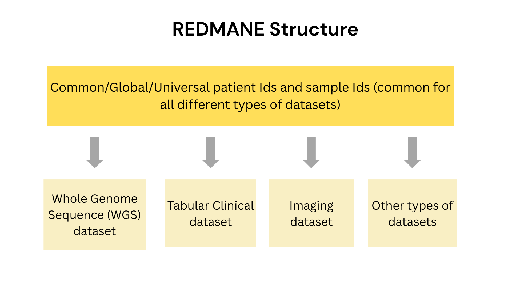
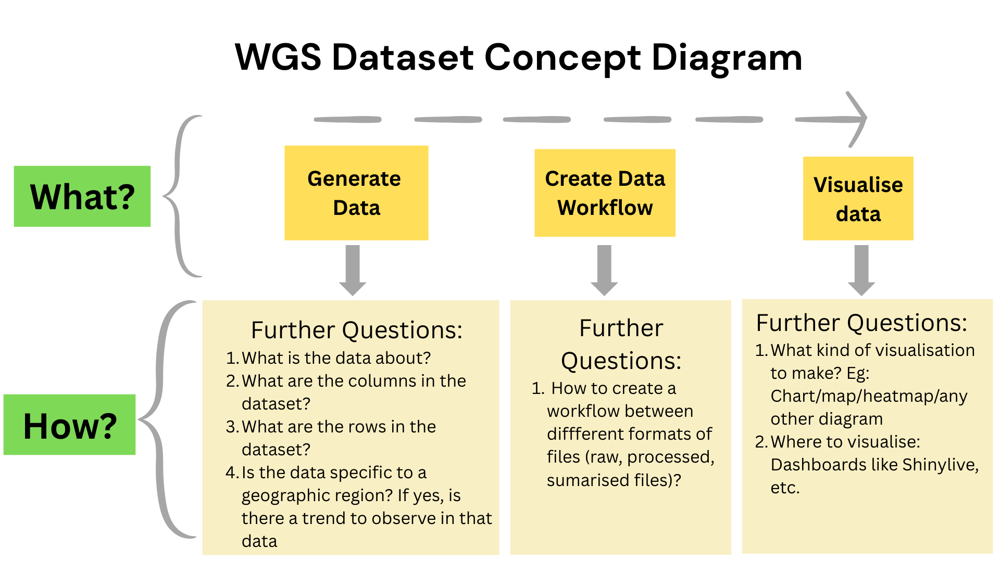

```{r setup, include=FALSE}
knitr::opts_chunk$set(echo = FALSE,
                      out.width = "100%",
                      out.extra="style='border:1px solid black;'")

```


I have been developing an R package {generatervis} which is useful to synthesise and visualise clinical data. This is the first blog in this series of blogs to share about the process from ideation to implementation.

# 📈 Research Data Management (RDM): How to handle and organise your research data?

  Data management is the process of collecting, storing, organising, and using data in a structured manner to ensure accuracy, completeness, and security. It involves all aspects of managing data throughout its lifecycle, from creation to deletion or archiving. Essentially, it's about making sure data is accessible, reliable, and used effectively to support operations and decision-making.  Data management becomes really difficult to achieve in a scenario where the research data is spread across multiple organisations, is multi-omics (genomics, transcriptomics, proteomics, and metabolomics) in nature, and is being published through different journals. To add more complexity to this, there are different versions/stages of the data files (raw, processed, summarised) throughout the data lifecycle, and ingesting the data into the essential workflows becomes all the more complex.  

#  🛠️ What’s the story behind REDMANE?

**RE**search **D**ata **M**anagement and **AN**alysis **E**nvironment (REDMANE) is a data management and analysis platform that was introduced to resolve these complex issues.

REDMANE resolves these issues by having the following features:

1. Lightweight and flexible ecosystem  
2. Doesn't need organisational buy-in  
3. Cheaper to run than full cloud solution  
4. Easily handles new data types  
5. Focused on importing information quickly and easily  
6. Single Sign On  
7. Can handle cross-organisation data easily

# ⚙️ A quick look at REDMANE’s structure

  


# 🧬 So, what exactly is Whole Genome Sequencing (WGS)?

Whole Genome Sequencing (WGS) data refers to the complete DNA sequence of an organism, including both coding and non-coding regions. It's a comprehensive analysis of an organism's genome, providing a detailed view of its genetic makeup. WGS is a powerful tool for genomics research, allowing scientists to identify genetic variations, study disease outbreaks, and more.

Some of the use cases for WGS data are:

* **Medical Genomics:** Diagnosing rare diseases, identifying cancer drivers, and personalised medicine.   
* **Evolutionary Biology:** Understanding species relationships and the evolution of life.   
* **Agriculture:** Improving crop and livestock breeding programs.   
* **Public Health:** Tracking disease outbreaks and developing new diagnostics.

WGS data in this R package is synthesised, instead of using real-world data so as to ensure that patient privacy is maintained and any potential security concerns are addressed while still making the data useful for research. As an example, sensitive data such as: medicare number, date of birth, location of residence, etc, are often included in clinical data. Therefore, the solution is to artificially or ‘synthetically’ generate clinical data that replicates real-world datasets.

# 🌼 What does a WGS dataset really look like? Here’s a snapshot.

  


# 🔎 Curious how the WGS dataset ties into REDMANE? Let’s walk through it.

REDMANE contains different types of datasets for the sample patient ID and the sample ID. One of these dataset types is WGS data. In this blog series, we will explore the process of file creation, dataset creation, and workflow creation for the WGS dataset.  


The above diagram shows a maturity model for creating WGS data files and uploading them to the cBioportal. cBioportal is a widely used free, open-source online database useful to explore, analyse and visualise cancer genomics data.

## 🛠️ Here’s a quick guide to creating WGS data files

Step 1: Create empty files with the correct file names for the workflow.  
Step 2: Add minimal sample data to the empty files.  
Step 3: Add more sample data to the minimal files.

# 🎯 Next steps

Some of the potential next steps include

* To create the workflow for WGS dataset files.  
* The 4th step in the maturity model, i.e., uploading the WGS dataset into cBioportal.  
* For other dataset types, like Tabular Circular data, Imaging Dataset, etc., implementing the process of creating the dataset and then uploading it to cBioportal.  
* To visualise for WGS datasets.

P.S.: The project development is done using CI/CD. To know further, keep an eye on future blog posts in this series.

# 🔑 Resources created

1. A website to give a brief introduction and demo of the R package {gereratervis} is: [https://clinical-informatics-collaborative.github.io/generatervis/](https://clinical-informatics-collaborative.github.io/generatervis/)   
2. The work-in-progress source code for the R package is available at: [https://github.com/Clinical-Informatics-Collaborative/generatervis](https://github.com/Clinical-Informatics-Collaborative/generatervis) 

# 💡References

1. [R Packages (2e)](https://r-pkgs.org/) by Hadley Wickham and Jennifer Bryan, [CC BY-NC-ND 4.0](https://creativecommons.org/licenses/by-nc-nd/4.0/) License  
2. R package [{Shinylive}](https://cloud.r-project.org/web/packages/shinylive/readme/README.html#:~:text=The%20goal%20of%20the%20%7Bshinylive,WebAssembly%20via%20the%20webR%20project)


## Get In Touch:

**Email:** [bhogaljyoti1@gmail.com](mailto:bhogaljyoti1@gmail.com)   
**LinkedIn:** [jyoti-bhogal](http://www.linkedin.com/in/jyoti-bhogal)  
**GitHub:** [jyoti-bhogal](https://github.com/jyoti-bhogal)   
**Mastodon:** [jyoti_bhogal](https://mastodon.social/@jyoti_bhogal)

**Bluesky:** [jyoti-bhogal.bsky.social](https://bsky.app/profile/jyoti-bhogal.bsky.social)

**Website:** https://jyoti-bhogal.github.io/about-me/index.html

