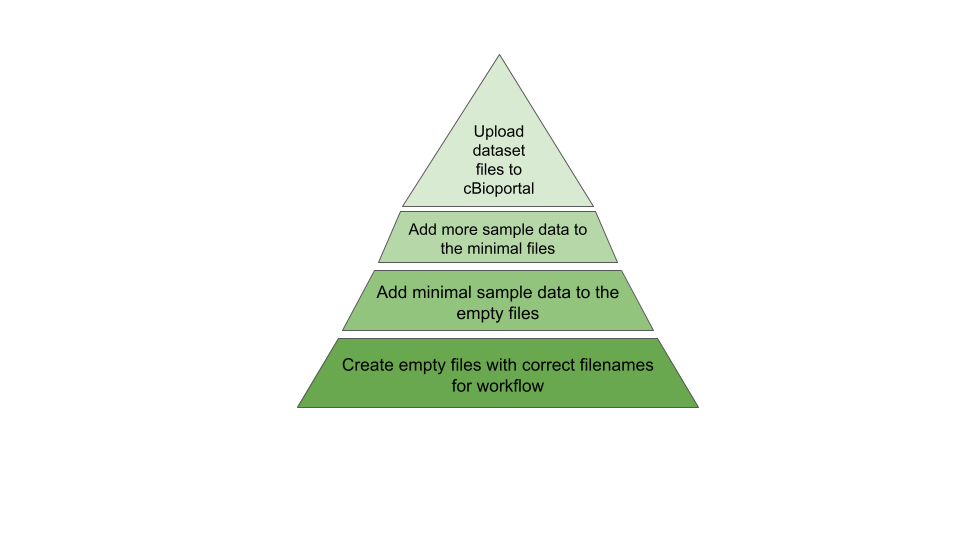

```{r setup, include=FALSE}
knitr::opts_chunk$set(echo = FALSE,
                      out.width = "100%",
                      out.extra="style='border:1px solid black;'")

```


This is the second blog in the series of blogs about my first open-source R package {generatervis}. In this blog, I share how I convert the domain knowledge into a flowchart for developing an MVP of the package.

## 📝 Figuring out what we really need

Over the past several weeks, I have been discussing with my cohort fellows and our mentor [Rowland Mosbergen](https://www.linkedin.com/in/rowlandm-gaicd/). The domain of Whole Genome Sequencing (WGS) is very vast, and the first lesson we have learnt is to ***narrow down the problem space*** we are trying to solve and ***create a roadmap*** for what we want to implement. Based on the requirements that we have gathered so far, I have created the following maturity model of a research data management workflow for creating and ingesting the WGS dataset into REDMANE.



## 🧠 Creating a flowchart: How am I approaching this?

As a next step, I divided the different stages of the maturity model into further granular and achievable chunks. These steps help to create a basic workflow that starts with creating empty files in the `.fastq` format for the WGS dataset and eventually uploading the modified file(s) to cBioportal, an open-source platform to explore and analyse large-scale cancer genomic datasets.

## 🌼 Bringing the mental model to life, step by step


When creating this flowchart, I made the assumption that there is only one sample per patient. 

Once I created the flowchart, it became much easier for me to start implementing the steps into the functions of the package. With the goal of developing a functional MVP version of the package, I have written the following functions in it: 

1. [create_empty_fastq()](https://github.com/Clinical-Informatics-Collaborative/generatervis/blob/main/R/create_empty_fastq.R): A function to create empty .fastq files  
2. [rreads():](https://github.com/Clinical-Informatics-Collaborative/generatervis/blob/main/R/rreads.R) A function to generate a random sample for reads 

### ⬇️ Using the package {generatervis}:

The development version of the {generatervis} R package can be installed from GitHub using:

```{r, echo = TRUE}  
# install.packages("pak")  
pak::pak("Clinical-Informatics-Collaborative/generatervis")  
```  
Once the package is installed, it can be used to perform the workflow steps as follows:

### 🧑‍💻 Creating an empty `.fastq` file

An empty `.fastq` file can be created for a specified patient ID (or for multiple patient ID) using the `create_empty_fastq()` function. It has the following input parameters:

* *patient_id*: A character vector representing the patient IDs.  
* *output_dir*: A character string specifying the directory where the FASTQ file will be saved. Default is the current working directory.

Here is a demo code to create an empty `.fastq` file for patient ID `”patient_123”` using the [create_empty_fastq()](https://github.com/Clinical-Informatics-Collaborative/generatervis/blob/main/R/create_empty_fastq.R) function:

```{r, echo = TRUE}  
generatervis::create_empty_fastq(patient_id = "patient_123")  
```

### 🧑‍💻 Generating a random sample of reads

To generate a random sample of reads of size `n`, for a specified patient ID, use the `rreads()` function. It has the following input parameters:

* *patient_id*: A character string representing the patient ID.  
* *n*: An integer specifying the number of reads to generate.  
* *read_length*: An integer specifying the length of each read. The default is 8.

Here is a demo code to generate a random sample of 2 reads for patient ID "patient_123" with read length 12 using the [rreads()](https://github.com/Clinical-Informatics-Collaborative/generatervis/blob/main/R/rreads.R) function:

```{r, echo = TRUE}  
generatervis::rreads(patient_id = "patient_123", n = 2, read_length = 12)  
```

```{output}  
[1] "@patient_123_read1" "GGCCGGCTGTTG"       "+"                  "IIIIIIIIIIII"      
[5] "@patient_123_read2" "CTGAACCAATTA"       "+"                  "IIIIIIIIIIII"     
```

# 🎯 Next steps

Some of the potential next steps include:

1. Implement the remaining steps of the workflow for WGS dataset files.  
2. For other dataset types, like Tabular Circular data, Imaging Dataset, etc., implement the process of creating the dataset and uploading it to cBioportal.

P.S.: The project development is done using CI/CD. To know further, keep an eye on future blog posts in this series.

# 🔑 Resources created

1. {generatervis} website: [https://clinical-informatics-collaborative.github.io/generatervis/](https://clinical-informatics-collaborative.github.io/generatervis/)   
 

# 💡References

1. [R Packages (2e)](https://r-pkgs.org/) by Hadley Wickham and Jennifer Bryan, [CC BY-NC-ND 4.0](https://creativecommons.org/licenses/by-nc-nd/4.0/) License  
2. For more reading about Bioconductor R packages for WGS data, see: https://www.bioconductor.org/packages/release/BiocViews.html#___Software


## Get In Touch:

**Email:** [bhogaljyoti1@gmail.com](mailto:bhogaljyoti1@gmail.com)   
**LinkedIn:** [jyoti-bhogal](http://www.linkedin.com/in/jyoti-bhogal)  
**GitHub:** [jyoti-bhogal](https://github.com/jyoti-bhogal)   
**Mastodon:** [jyoti_bhogal](https://mastodon.social/@jyoti_bhogal)

**Bluesky:** [jyoti-bhogal.bsky.social](https://bsky.app/profile/jyoti-bhogal.bsky.social)

**Website:** https://jyoti-bhogal.github.io/about-me/index.html

