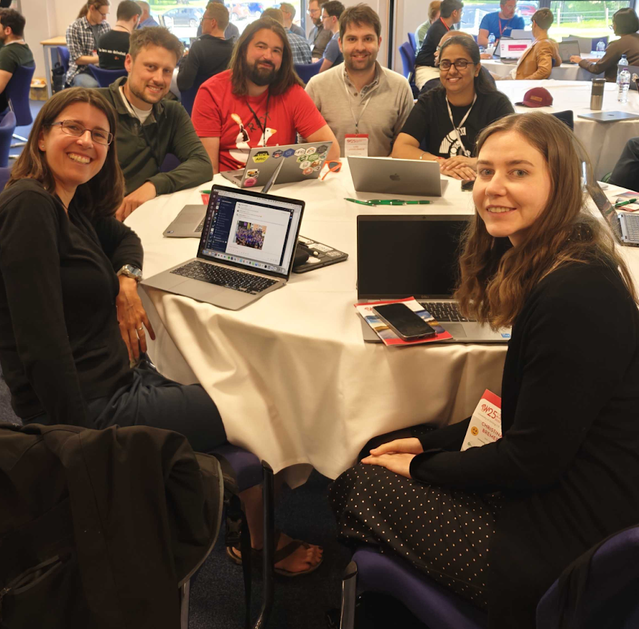
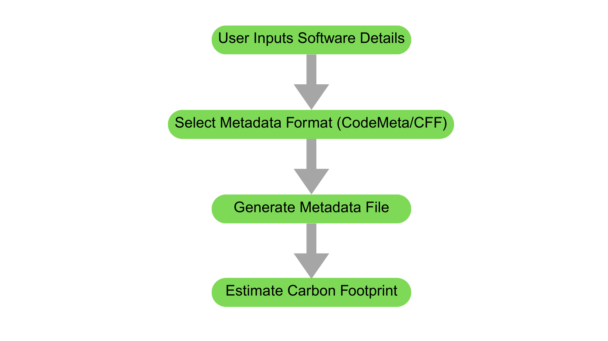

```{r setup, include=FALSE}
knitr::opts_chunk$set(echo = FALSE,
                      out.width = "100%",
                      out.extra="style='border:1px solid black;'")

```

Ever thought about how much energy your code consumes? Or how to make your software more eco-friendly? Well, during the recent [Collaborations Workshop 2025 Hack Day](https://www.software.ac.uk/workshop/collaborations-workshop-2025-cw25), my team decided to tackle this very challenge. Let me walk you through our journey.


The third day of the [Collaborations Workshop 2025](https://www.software.ac.uk/workshop/collaborations-workshop-2025-cw25) was a dedicated Hack Day. The attendees were invited to pitch ideas for the Hack Day. Many wonderful ideas were pitched for the same. People started joining the team with the idea in which they were most interested to work upon. Ultimately, 10 teams were formed. The 10 teams collaborated for an intense hack day, leading to amazing ideas taking shape by the end of the day\!  Earlier on the second day of the workshop I had attended a collaborative ideas discussion session on “**MetaGreenData: standardised reporting of the environmental impact of compute**” **chaired by Kirsty Pringle and joined by Bryn Ubald, Caterina Doglioni, Connor Aird, Jyoti Bhogal, and Saranjeet Bhogal**. This session motivated me to join the “Group: D \- Delphinium” team for the Hack Day (Team members: Christina Bremer, Duncan Leggatt, Jyoti Bhogal, Loïc Lannelongue, Will Haese-Hill; Joining remotely: Michael Sparks). I enjoyed collaborating with my team during the Hack Day \- we divided the tasks amongst each other. Throughout the day the judges visited the different teams asking questions, and at the end of the day, we were asked to provide a presentation of the work we did. In this blog post, I share the product my team created by the end of the Hack Day\! 



## **🚀 Motivation**

While many developers are keen on optimising their code for speed and efficiency, not many consider the environmental impact. That's where my team saw the opportunity. The idea was simple: **create a tool that helps developers understand and reduce the carbon footprint of their software**.

## **🧠 Brainstorming the Solution**

The brainstorming session was filled with energy and ideas. The motive was to come up with a  solution that was:

* **User-friendly**: Easy for developers to integrate into their workflow.

* **Informative**: Provides clear insights into the environmental impact.

* **Actionable**: Offers suggestions to reduce carbon emissions.

After much discussion, it was decided to have a metadata generator that captures essential information about software, making it easier to assess and improve its sustainability.

## **🛠️ Building MetaGreenData**

Enter [**MetaGreenData**](https://github.com/GreenAlgorithms/MetaGreenData). This is a Django-based web application designed to help developers generate metadata files for their software projects. Here's how it was designed:

1. **Understanding the Standards**: To begin with, existing metadata standards, like [CodeMeta](https://codemeta.github.io/codemeta-generator/) and the [Citation File Format (CFF)](https://citation-file-format.github.io/), were explored. These standards provide a structured way to describe software, making it easier to share and cite.

2. **Designing the Workflow**: Then a simple form was created where users can input details about their software. This included information like the software's name, version, authors, and more.

3. **Generating the Metadata**: The tool was designed to generate a metadata file in the chosen format (CodeMeta or CFF) based on the input. This file can then be added to the software's repository.

4. **Integrating Carbon Footprint Estimation**: Next, the [Green Algorithms calculator](https://calculator.green-algorithms.org/) was integrated to estimate the carbon footprint based on the software's computational requirements.

## **🔍 Visualising the Process**

To make things clearer, here's a simple flowchart of how MetaGreenData works:



## **📦 The Outcome**

MetaGreenData is now available on GitHub\! 🎉

* [MetaGreenData Repository on GitHub](https://github.com/GreenAlgorithms/MetaGreenData)

* **How to Use**: For detailed instructions, check out the [README file](https://github.com/GreenAlgorithms/MetaGreenData?tab=readme-ov-file#metagreendata).

Last but definitely not the least this project won the first prize at the Collaborations Workshop 2025 Hack Day. Here’s my team’s picture from the day\!

; (L to R) Christina Bremer, Will Haese-Hill, Duncan Leggatt, Loïc Lannelongue, Jyoti Bhogal, Joining remotely: Michael Sparks.*](first_prize_group_photo.jpeg)

And here’s my certificate:

, organised by the [Software Sustainability Institute](https://www.software.ac.uk/).](first_jyoti_bhogal_certificate.jpg)

## **📚 References and Inspirations**

The project was inspired and informed by several resources:

* [**Green Algorithms Calculator**](https://calculator.green-algorithms.org/): Helps estimate the carbon footprint of computations.

* [**CodeMeta Generator**](https://codemeta.github.io/codemeta-generator/): Assists in creating standardised metadata files.

* [**Citation File Format (CFF)**](https://citation-file-format.github.io/): Provides a human- and machine-readable format for software citation.

* [**Draft Metadata Fields**](https://docs.google.com/spreadsheets/d/1hVlRnbE-3183r3hRLakNV0_-KTvuAxtAyhyueGY8gtg/edit?pli=1&gid=0#gid=0): A comprehensive list of metadata fields for software tools.

**🔭 Looking Ahead**

MetaGreenData is just the beginning. The vision is of a future where sustainability is a core consideration in software development. By making it easier to assess and reduce the environmental impact of code, the hope is to inspire developers to make greener choices.

## Get In Touch:

**Email:** [bhogaljyoti1@gmail.com](mailto:bhogaljyoti1@gmail.com)   
**LinkedIn:** [jyoti-bhogal](http://www.linkedin.com/in/jyoti-bhogal)  
**GitHub:** [jyoti-bhogal](https://github.com/jyoti-bhogal)   
**Mastodon:** [jyoti_bhogal](https://mastodon.social/@jyoti_bhogal)

**Bluesky:** [jyoti-bhogal.bsky.social](https://bsky.app/profile/jyoti-bhogal.bsky.social)

**Website:** https://jyoti-bhogal.github.io/about-me/index.html

