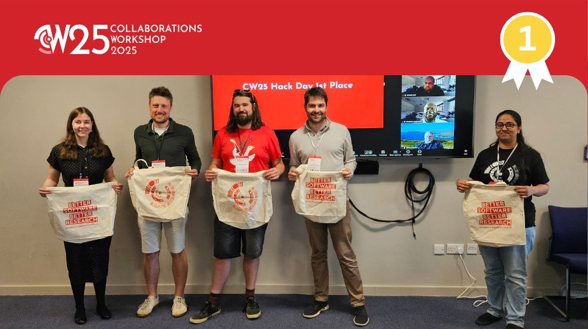
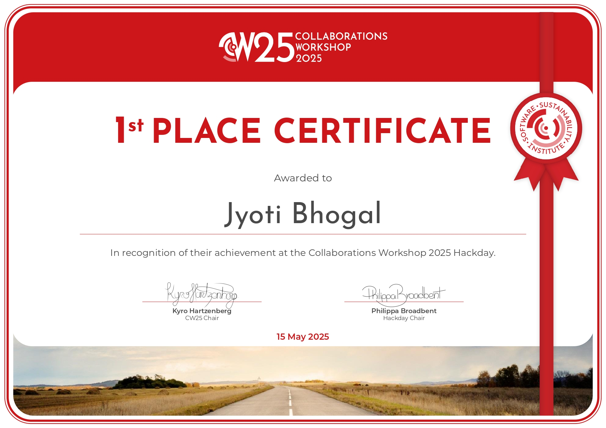

```{r setup, include=FALSE}
knitr::opts_chunk$set(echo = FALSE,
                      out.width = "100%",
                      out.extra="style='border:1px solid black;'")

```

Ever thought about how much energy your code consumes? Or how to make your software more eco-friendly? Well, during the recent [Collaborations Workshop 2025 Hack Day](https://www.software.ac.uk/workshop/collaborations-workshop-2025-cw25), my team decided to tackle this very challenge. Let me walk you through my journey.

*](GLOBE---1850-2024-MO.png)

## **🚀 The Spark: Why I Started**

I noticed that while many developers are keen on optimising their code for speed and efficiency, not many consider the environmental impact. That's where I saw an opportunity. Our idea was simple: **create a tool that helps developers understand and reduce the carbon footprint of their software**.

## **🧠 Brainstorming the Solution**

Our brainstorming session was filled with energy and ideas. We wanted a solution that was:

* **User-friendly**: Easy for developers to integrate into their workflow.

* **Informative**: Provides clear insights into the environmental impact.

* **Actionable**: Offers suggestions to reduce carbon emissions.

After much discussion, we landed on the idea of a metadata generator that captures essential information about software, making it easier to assess and improve its sustainability.

## **🛠️ Building MetaGreenData**

Enter [**MetaGreenData**](https://github.com/GreenAlgorithms/MetaGreenData). This is our Django-based web application designed to help developers generate metadata files for their software projects. Here's how we approached it:

1. **Understanding the Standards**: We looked into existing metadata standards like [CodeMeta](https://codemeta.github.io/codemeta-generator/) and the [Citation File Format (CFF)](https://citation-file-format.github.io/). These standards provide a structured way to describe software, making it easier to share and cite.

2. **Designing the Workflow**: We created a simple form where users can input details about their software. This includes information like the software's name, version, authors, and more.

3. **Generating the Metadata**: Based on the input, our tool generates a metadata file in the chosen format (CodeMeta or CFF). This file can then be added to the software's repository.

4. **Integrating Carbon Footprint Estimation**: We integrated the [Green Algorithms calculator](https://calculator.green-algorithms.org/) to estimate the carbon footprint based on the software's computational requirements.

## **🔍 Visualising the Process**

To make things clearer, here's a simple flowchart of how MetaGreenData works:

\[User Inputs Software Details\]  
             |  
             v  
\[Select Metadata Format (CodeMeta/CFF)\]  
             |  
             v  
\[Generate Metadata File\]  
             |  
             v  
\[Estimate Carbon Footprint\]

## **📦 The Outcome**

We are proud to share that MetaGreenData is now available on GitHub\! 🎉

* **Repository**: [MetaGreenData on GitHub](https://github.com/GreenAlgorithms/MetaGreenData)

* **How to Use**: For detailed instructions, check out the [README file](https://github.com/GreenAlgorithms/MetaGreenData?tab=readme-ov-file#metagreendata).

We won the first prize at the Collaborations Workshop 2025 Hack Day. Here’s the pictures from the day\!



And here’s my certificate of winning:




## **📚 References and Inspirations**

Our project was inspired and informed by several resources:

* **Green Algorithms Calculator**: Helps estimate the carbon footprint of computations. [Link](https://calculator.green-algorithms.org/)

* **CodeMeta Generator**: Assists in creating standardised metadata files. [Link](https://codemeta.github.io/codemeta-generator/)

* **Citation File Format (CFF)**: Provides a human- and machine-readable format for software citation. [Link](https://citation-file-format.github.io/)

* **Draft Metadata Fields**: A comprehensive list of metadata fields for software tools. [Link](https://docs.google.com/spreadsheets/d/1hVlRnbE-3183r3hRLakNV0_-KTvuAxtAyhyueGY8gtg/edit?pli=1&gid=0#gid=0)

**🔭 Looking Ahead**

MetaGreenData is just the beginning. We envision a future where sustainability is a core consideration in software development. By making it easier to assess and reduce the environmental impact of code, we hope to inspire developers to make greener choices.

## Get In Touch:

**Email:** [bhogaljyoti1@gmail.com](mailto:bhogaljyoti1@gmail.com)   
**LinkedIn:** [jyoti-bhogal](http://www.linkedin.com/in/jyoti-bhogal)  
**GitHub:** [jyoti-bhogal](https://github.com/jyoti-bhogal)   
**Mastodon:** [jyoti_bhogal](https://mastodon.social/@jyoti_bhogal)

**Bluesky:** [jyoti-bhogal.bsky.social](https://bsky.app/profile/jyoti-bhogal.bsky.social)

**Website:** https://jyoti-bhogal.github.io/about-me/index.html

