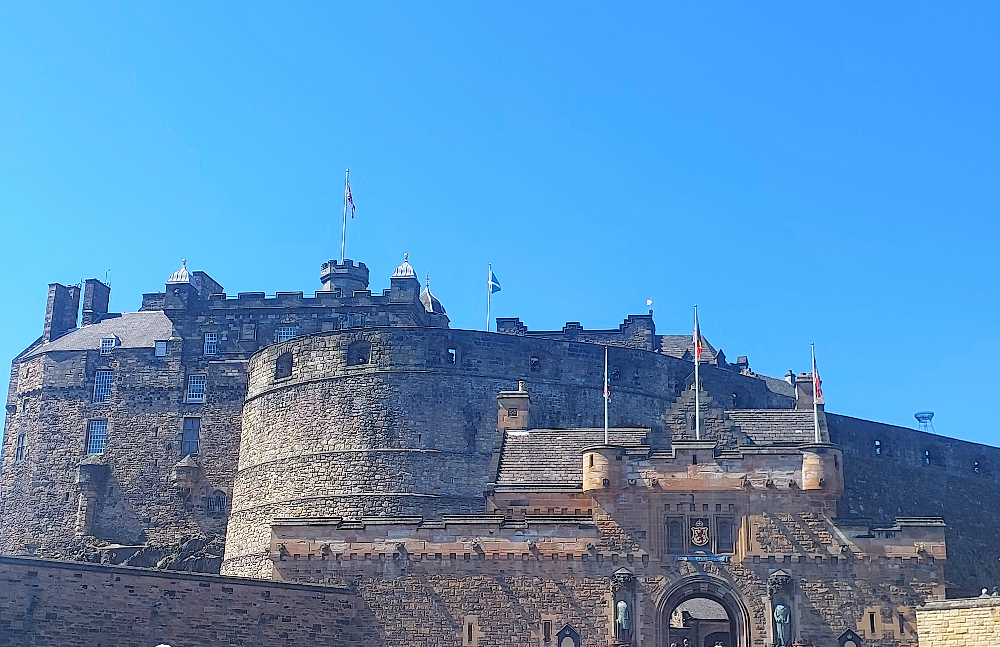
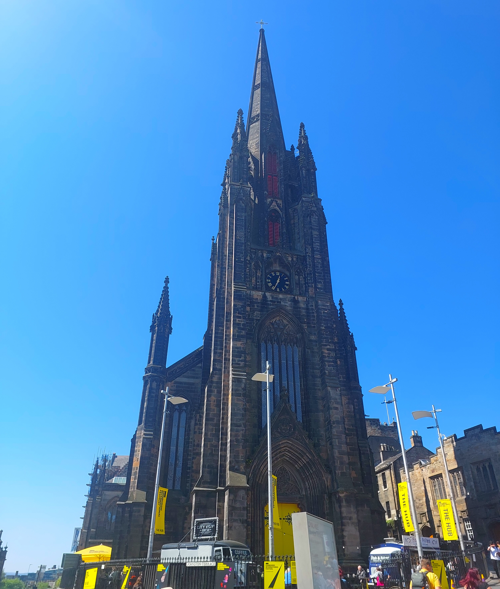
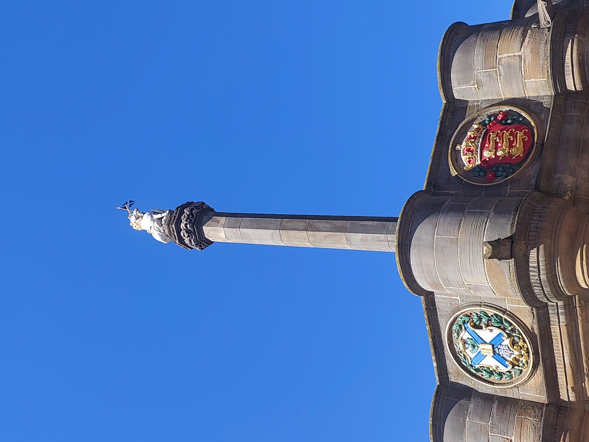
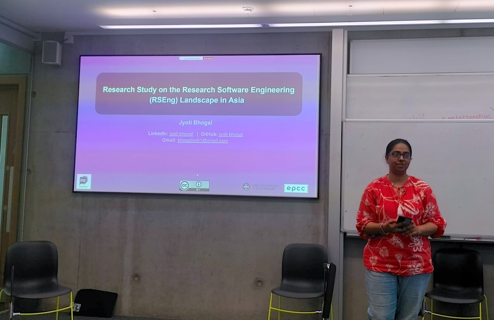
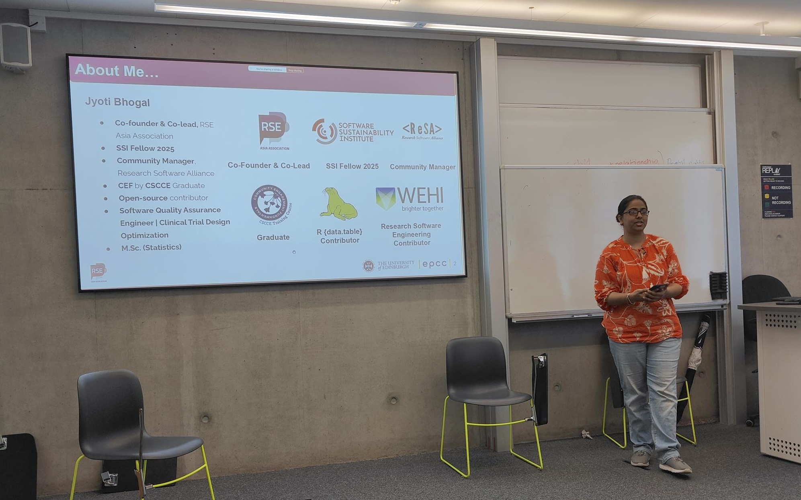
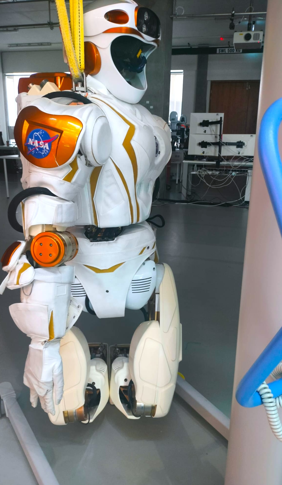
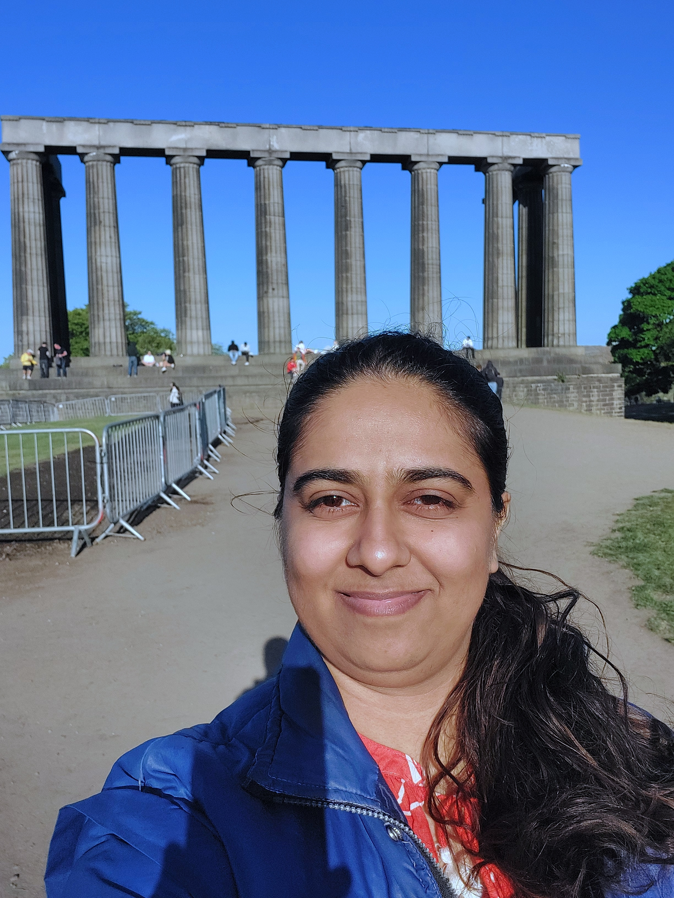
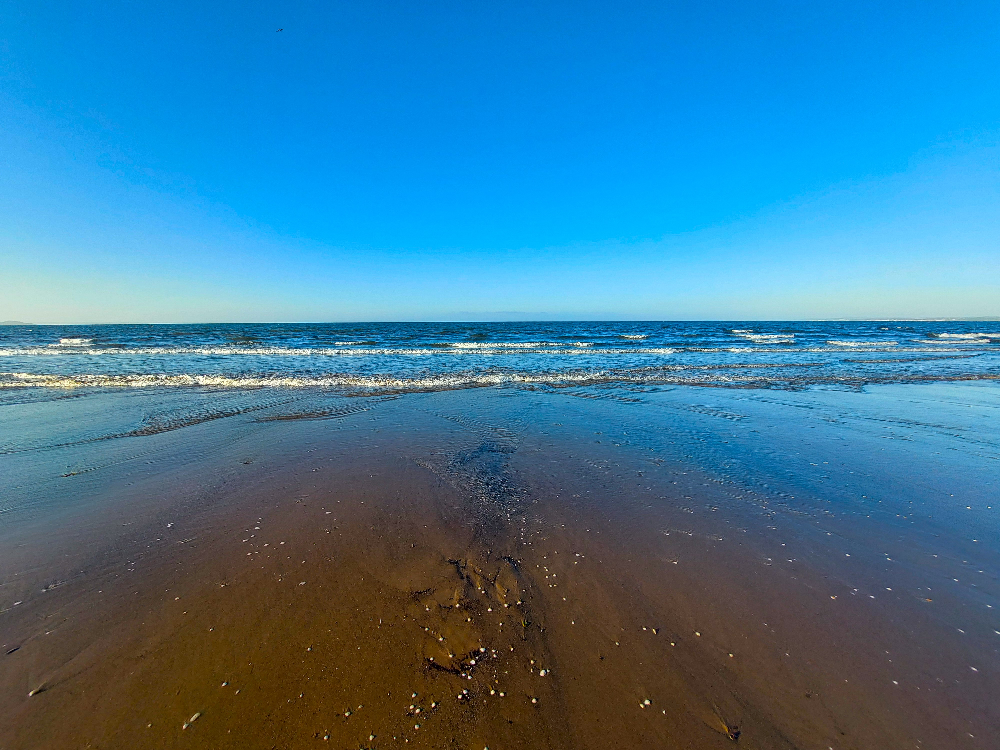

```{r setup, include=FALSE}
knitr::opts_chunk$set(echo = FALSE,
                      out.width = "100%",
                      out.extra="style='border:1px solid black;'")

```



  



As part of my SSI Fellowship project, I was invited by the [EPCC, University of Edinburgh](https://www.epcc.ed.ac.uk/), to visit and give a talk about my work, following my participation in the [Collaborations Workshop 2025](https://www.software.ac.uk/workshop/collaborations-workshop-2025-cw25) organised by the [Software Sustainability Institute](https://www.software.ac.uk/) at the [University of Stirling](https://www.stir.ac.uk/). I want to thank [Neil Chue Hong](https://www.linkedin.com/in/neilchuehong/) for the invitation and [Cathrine Inglis](https://www.linkedin.com/in/catherineinglis/) for organising the talk so well and giving me a comfortable visit to the EPCC, University of Edinburgh.

It was a bright Friday summer afternoon, and around 50 people turned up for the talk in-person and remotely. 



 

I spoke about my ongoing ‘Research Study on the Research Software Engineering (RSEng) Landscape in Asia’.

# Who Am I?

Before we go into the details of the study, a bit about my background:

I am the Co-founder and Co-Lead of the volunteer driven [RSE Asia Association](https://rse-asia.github.io/RSE_Asia/) community, which works towards building an RSE community in the Asian region.  
I am also an [SSI Fellow 2025](https://www.software.ac.uk/fellowship-programme/jyoti-bhogal) for this project. I currently work as a Community Manager for the Research Software communities. Last year, I graduated from the CSCCE’s [Community Engagement Fundamentals](https://badgr.com/public/assertions/SHsdenPsRfCIphr4pvso3A?identity__email=bhogaljyoti1@gmail.com) course which has been great as it gave me a new vocabulary to describe the community and thus represent it better. I am a Research Software Engineering Contributor at the Walter and Eliza Hall Institute of Medical Research (WEHI), where I contribute to my first open-source \`R\` package called \`[{generatervis}](https://github.com/Clinical-Informatics-Collaborative/generatervis)\`. I am an active contributor to the \`R {data.table}\` community project, where I contribute by translating the R messages from English to Hindi. My journey until here has been shaped up by several communities that I have been part of including the OLS and the R-Ladies.I have been an [OLS mentee](https://we-are-ols.org/openseeds/ols-5/projects-participants.html#jyoti-bhogal) in the cohorts 4 and 5 between 2021 and 2022, where the RSE Asia Association was incubated 4 years back\! As a community member of the R Ladies Global community I have been their rotating curator for social media. I was a PyData Global Impact Scholar during 2021\.

This talk was a very special opportunity for me as I went all the way from India to the UK for the first time to attend my first [Collaborations Workshop](https://www.software.ac.uk/workshop/collaborations-workshop-2025-cw25) which happened at the University of Stirling, Scotland and give a talk and meet people at the EPCC, University of Edinburgh, Edinburgh, Scotland. It was a time for a lot of firsts\! First time in the Uk, in Scotland, at the Collaborations Workshop (and also winning the first prize there 🎉)\! As most of us would agree, the firsts are always the most memorable. 

# What is RSE Asia?

We had launched the RSE Asia Association back in 2021 as there was no acknowledgement to the RSE profession in the Asian region. Over the past 3+ years we have conducted and participated in various events and workshops to raise awareness about the profession and the community. There are no roles in the Asian region with the title RSE. Based on the reflections over this period, I started to explore the RSE landscape in the Asian region to get better informed insights.

# What is the project?

The motivation to write this proposal was gained after getting positive feedback on this idea when I shared it with the Open Life Science leadership. I was further encouraged to take this work ahead when I proposed the idea during my talk on ‘[What is Research Software and Why Should we Think About its Sustainability?](https://zenodo.org/records/13377699)’ at the 58th meeting of the Asia Pacific Advanced Network (APAN58) during August 2024, which was attended by delegates from across Asia Pacific as well as the globe.

I have been developing this idea since then, and have been encouraged and supported to do so by several RSE community members, SSI fellows, and community leaders. 

Speaking of why this study is required \- this study is essential for several reasons, some of which are:  

* Diversifying and expanding the research software landscape  
* Addressing the lack of formal RSE roles in Asia  
* Leveraging international partnerships  
* Community building and support

SSI has been conducting surveys to study the RSE landscape since 2018\. However, there has been almost no representation of Asia in these surveys.  

.*](ssi_survery_map.png)

Within Asia, the Asia-Pacific Advanced Network (APAN) is an organization that represents member institutions as well as a backbone network connecting member countries and regions to each other and to other international research and education networks. I am part of its Open and Sharing Data Working Group (OSDWG). This WG is interested in Open Science and Software programming within research roles/institutes.

Here is a visual representation of the different members of APAN.

.*](apan_current_members.png)

So far in this project, I have been able to refine the SSI projects to make them more suitable to the Asian context. I have also launched a pilot survey with a small group in APAN OSDWG in order to gain insights about the refinement of the questions to suit the Asian context.

The next steps would be to:  
🎯 Refine the survey further based on feedback from the pilot survey.  
🎯 Launch the full survey to a larger group in Asia.

I want to acknowledge [Saranjeet Kaur](https://www.linkedin.com/in/saranjeet-kaur-b-48ab769b/), on whose work so far this project is built upon, and [Yo Yehudi](https://www.linkedin.com/in/yoyehudi/) and [Jeremy Cohen](https://www.linkedin.com/in/jeremy-c-aa49971/) for mentoring me.

My talk was followed by a number of engaging questions from people in the audience \- in-person and remote\! The talk smoothly transitioned into EPCC’s ritual of ‘Friday Buns’, where everywhere enthusiastically spoke to Saranjeet and me about the challenges we face while running the RSE Asia Association, and what could be our future steps\!  

 

  

# 🎉 Culture\!

Apart from the talk, Catherine Inglis and Neil Chue Hong gave me a tour of the EPCC, and showed us around the campus of the University of Edinburgh. Catherine also introduced us to several of her colleagues at the EPCC. It was lovely to have a nice lunch out in the warm and bright weather\! It was during the chats with Catherine and Neil, I got to know that Unicorn 🦄 \- an imaginary creature \- it the national animal of Scotland \- and then it made sense to me why the architecture in Edinburgh has unicorn statues built into them\!

After the talk, I also walked up the Calton hill and got to see 360° view of the city, the valleys, as well as the beautiful North Sea.   

  



## 🔑 Resources:

1. Talk slides: [https://zenodo.org/records/15450346](https://zenodo.org/records/15450346) 

## 📩 Get In Touch:

RSE Asia LinkedIn: [https://www.linkedin.com/company/rse-asia-association/?viewAsMember=true](https://www.linkedin.com/company/rse-asia-association/?viewAsMember=true)   
RSE Asia email: [rse.asia.association@gmail.com](mailto:rse.asia.association@gmail.com)  
RSE Asia website: [https://rse-asia.github.io/RSE\_Asia/](https://rse-asia.github.io/RSE_Asia/) 

Email: [bhogaljyoti1@gmail.com](mailto:bhogaljyoti1@gmail.com)   
LinkedIn: [www.linkedin.com/in/jyoti-bhogal](http://www.linkedin.com/in/jyoti-bhogal)   
GitHub: [https://github.com/jyoti-bhogal](https://github.com/jyoti-bhogal)    
Mastodon: [https://mastodon.social/@jyoti\_bhogal](https://mastodon.social/@jyoti_bhogal)   
Bluesky: [https://bsky.app/profile/jyoti-bhogal.bsky.social](https://bsky.app/profile/jyoti-bhogal.bsky.social)   
Website: [https://jyoti-bhogal.github.io/about-me/index.html](https://jyoti-bhogal.github.io/about-me/index.html) 
