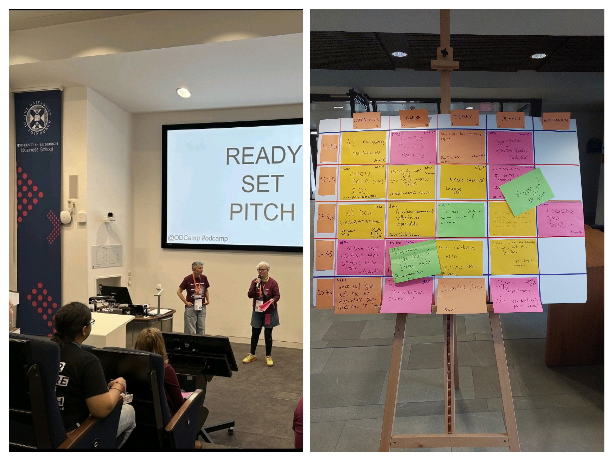
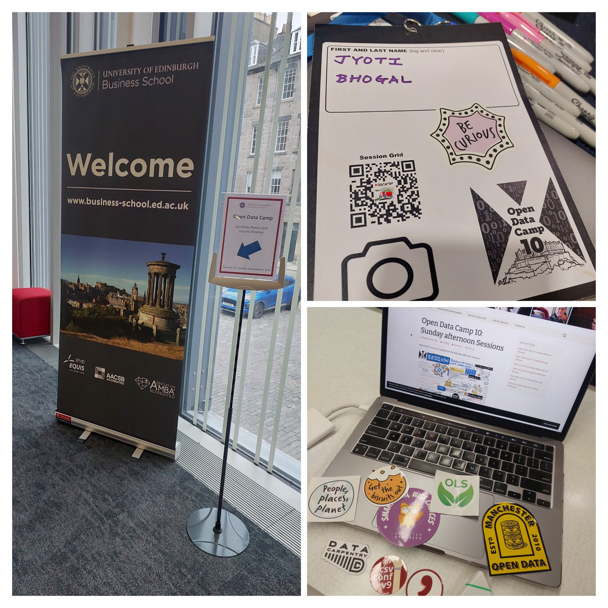
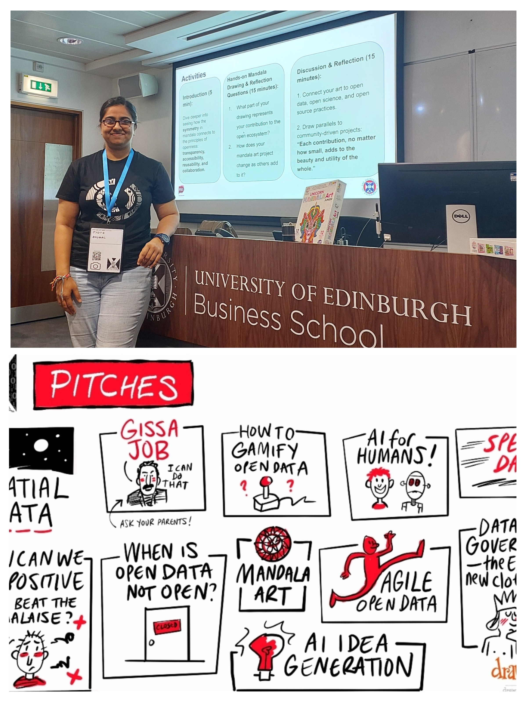
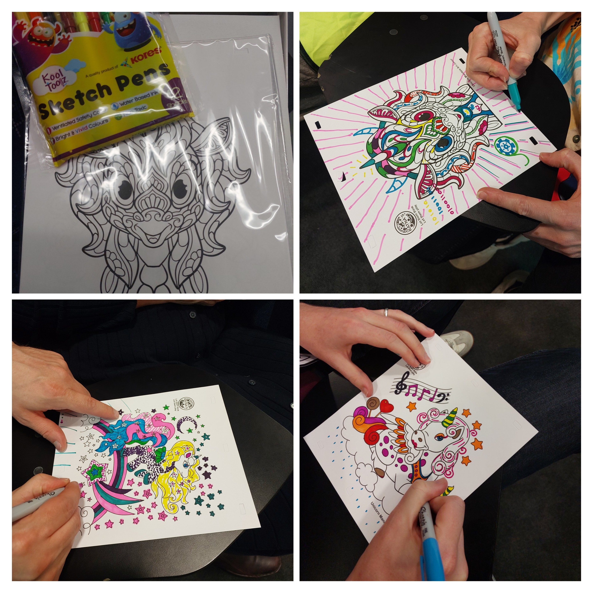
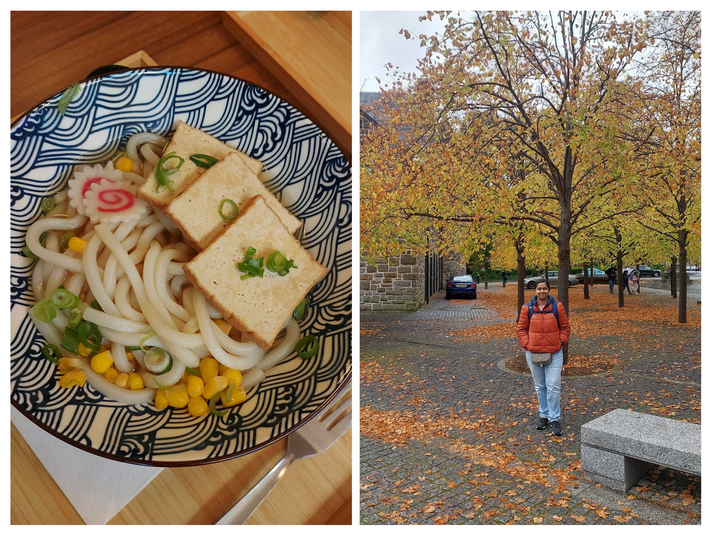

```{r setup, include=FALSE}
knitr::opts_chunk$set(echo = FALSE,
                      out.width = "100%",
                      out.extra="style='border:1px solid black;'")

```

Recently, I got the chance to attend **Open Data Camp 10 (ODC10)** for the very first time\! The event took place on 27–28 September 2025 at the University of Edinburgh Business School. It was an *unconference* style, which meant the event agenda was driven by the people, for the people. Each morning started with a pitching session where everyone was welcome to share their elevator pitch idea (in just 30 seconds\!). All the ideas were then put up on a big board (colourful sticky notes\!), and everyone was free to choose the topic they wanted to be a part of. I pitched something too, more on it later in the blog.



One of the discussions that stood out for me was on *Maturing Open Data.* I liked the idea of treating data like a product, something that has versions, documentation, and dedicated roles like analysts and lawyers. There was also discussion about platforms like Hugging Face for AI and how something similar could exist for data. In another session, there was a discussion on how to convince senior leaders to support open data policies, which made me think a lot about the different skills needed at different stages.



There were some big-picture policy discussions too. One of them was about the UK’s plan for a **National Data Library (NDL)**, with the idea of having a single federated place to store and access data. Another one was on **Digital IDs**, where the participants were asked to think about it both as citizens and as data professionals. This made the discussion really interesting.

## Unicorn Mandala art session

I pitched and ran a hands-on creative session called “Drawing Parallelism: A Unicorn Mandala Art Workshop on Open Data and Collaborations.” For this session, the participants were divided into three teams and I provided mandala kits to everyone so they could collaboratively create a unicorn design, chosen to honour Scotland’s national animal. My inspiration was simple: just as a mandala is built from many shapes and colours, the open ecosystem is built from many contributions. No single piece stands alone, but together they form something beautiful and meaningful.



As people coloured, we reflected on how this connected to open data and collaboration. Some participants approached it like their day-to-day work, for example, starting with the “infrastructure base” of the unicorn. Others experimented with by trying different colours and asymmetry, some chose non-conventional colours for the rainbow, and while others kicked off with a group chat about colour schemes. Some joined in later, just like how people can enter a project midway. A few filled entire sections at first but then shifted to patterns like dots and lines, showing how approaches evolve over time. We even had binary 1s and 0s added outside the design to represent data, and others added entirely new elements of their own.



When teams swapped their mandalas, keeping the same pens but working on someone else’s design, the dynamics shifted. People noticed it was harder to feel invested in a project they hadn’t started, and some worried the original team might disapprove of their additions, echoing real fears in collaborative projects. Yet, over time, new ideas emerged: like patterns, reflections on perspective (how the colours stayed even when the lines disappeared), and new layers that blended with the old. These discussions beautifully mirrored the challenges and joys of open collaborations: ownership, trust, creativity, and seeing projects evolve beyond their original intent.

Check out the session slides here: [https://zenodo.org/records/17260657](https://zenodo.org/records/17260657) 



What I really loved about the event was the freedom to move around thanks to the “**Law of Two Feet**: If a session didn’t feel meaningful to you, you are welcome to join another one”. There was also a fantastic team from **Drawnalism** who created live sketch notes of the sessions. As this was my first Open Data Camp, I was struck by how friendly, collaborative, and creative it was. Walking away from Edinburgh, my big takeaway is that **open data is not just about technology, it’s about people, culture, trust, and creativity\!**

## Get In Touch:

**Email:** [bhogaljyoti1@gmail.com](mailto:bhogaljyoti1@gmail.com)   
**LinkedIn:** [jyoti-bhogal](http://www.linkedin.com/in/jyoti-bhogal)  
**GitHub:** [jyoti-bhogal](https://github.com/jyoti-bhogal)   
**Mastodon:** [jyoti_bhogal](https://mastodon.social/@jyoti_bhogal)

**Bluesky:** [jyoti-bhogal.bsky.social](https://bsky.app/profile/jyoti-bhogal.bsky.social)

**Website:** https://jyoti-bhogal.github.io/about-me/index.html

