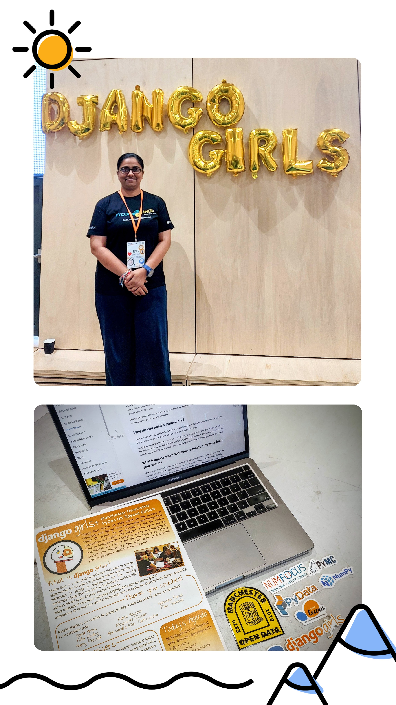
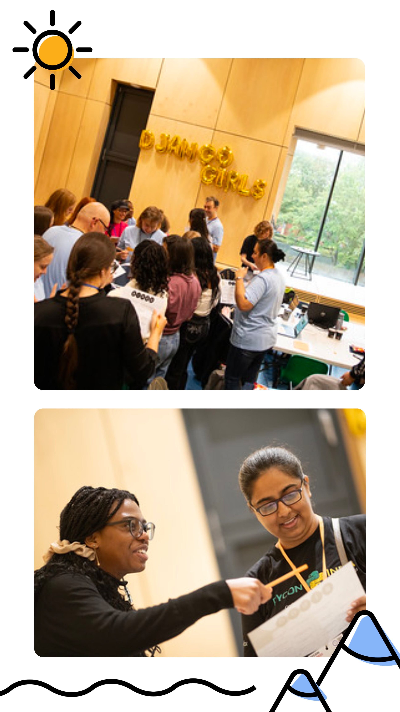
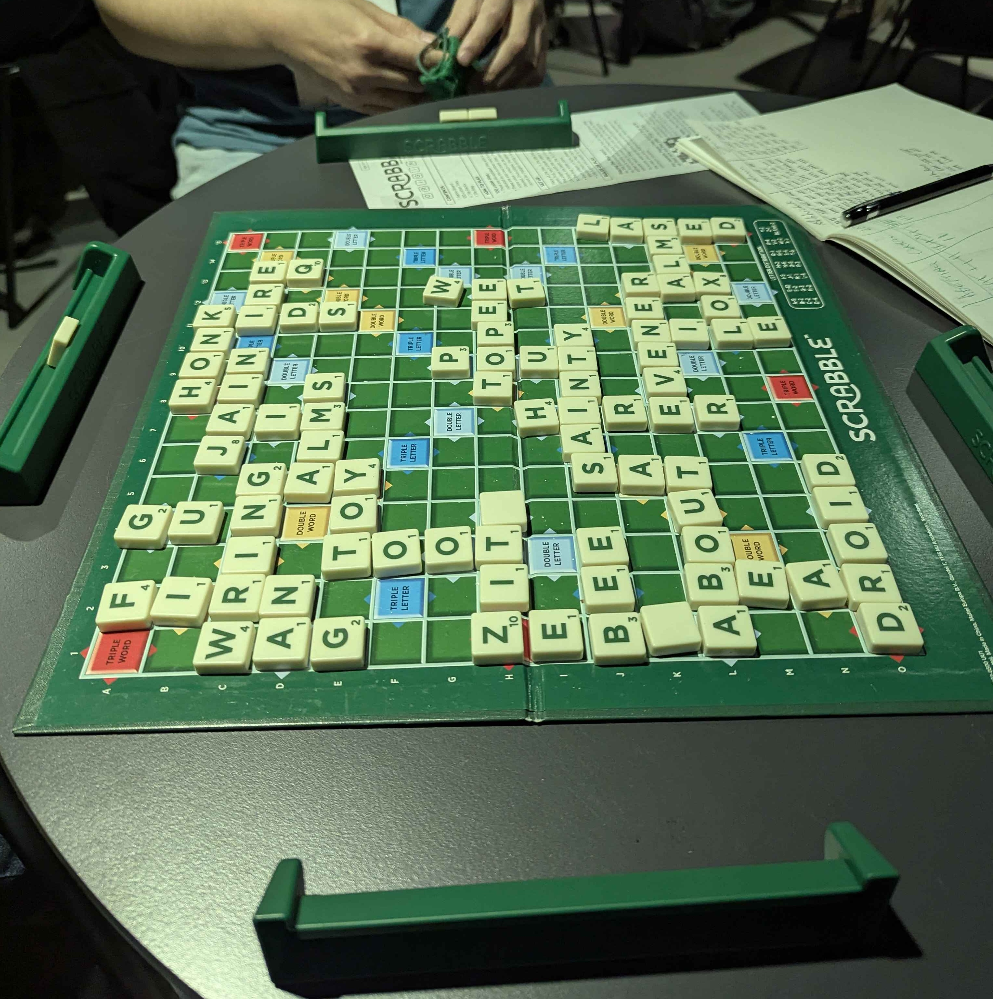

```{r setup, include=FALSE}
knitr::opts_chunk$set(echo = FALSE,
                      out.width = "100%",
                      out.extra="style='border:1px solid black;'")

```

 

PyCon UK 2025 took place at the Contact Theatre in Manchester, and the atmosphere was nothing short of inspiring—vibrant, diverse, friendly, and full of learning. Over four exciting days, the conference brought together an incredible mix of talks, workshops, collaborative dev sprints, amazing people, and, of course, great food. It was a space where ideas flowed freely, communities connected, and I had a lot of meaningful learnings to take away. The venue itself has a unique architecture, which is so conducive to creative and collaborative work.

# Day 1

  

Day 1 began with a warm welcome note from **Becky Smith**, who introduced us to the Python community across the UK and beyond. The first keynote of the conference was delivered by **Hynek Schlawack** on *“Python’s True Superpower.”* Among the many insights, one key takeaway for me was learning about **uv** \- a powerful Python tool that simplifies installation, project setup, and package management.

I also attended a fantastic talk by **Sasha Romijn** titled *“8 Python Performance Mistakes I Will Not Make Again.”* Sasha spoke in detail about common pitfalls such as skipping conversations about performance requirements with clients, making assumptions about bottlenecks without evidence, misreading profiling data, underestimating complexity, ignoring lessons from past work, and sticking rigidly to a single-core CPU. It was full of practical lessons that I’ll carry forward in future work.

Later in the day, participants were invited to pitch ideas for the lightning talks, which would take place in the final session. I pitched my idea on creating a Python package using **Hatch** for research data management \- and it got selected\! I eventually presented *“Five Common Research Data Management Issues & How to Resolve Them: With Python Packaging using Hatch from PyPI.”* You can watch the [recording here](https://jyoti-bhogal.github.io/about-me/talks/2025-09-17_pycon_uk_2025/), and the [slides are available as well](https://zenodo.org/records/17179268).

# Day 2

I dedicated the entire second day to the **Django Girls workshop**, and it was one of the highlights of the conference. The Django Girls volunteer team had curated a thoughtful, beginner-friendly program structure: participants were grouped into pairs or trios, and each group was assigned a coach. Throughout the day, we followed a detailed tutorial that guided us step-by-step \- from creating folders on our local machines to building a complete web app.

What stood out was how incredibly patient and knowledgeable the coaches were. Even the smallest questions were answered with clarity and depth, helping me connect how local code and servers relate to remote hosts and deployment. The detailed explanations really helped me understand the bigger picture of how Django works.

Here’s the GitHub repository for the Django app I built during the workshop:  
 🔗 [**https://github.com/jyoti-bhogal/my-django-blog**](https://github.com/jyoti-bhogal/my-django-blog)

I also spent some time chatting with sponsors at their stalls and participated in a fun Python quiz organised by **Flok Health**, where I learned something new about Python generators being a function or an expression that allows you to create iterators in a memory-efficient way\! They are particularly useful for working with large datasets or potentially infinite sequences, as they generate values on demand rather than storing the entire sequence in memory.





# Day 3

**Day 3 also had talks and workshops running in parallel.** The day began with a keynote by **Sheena O’Connell** titled *“Playing the Long Game.”* I really appreciated the advice Sheena shared for early-career professionals. When it comes to using GenAI and LLMs, Sheena emphasised that while they are great as a starting point, it is still essential to understand what the generated code actually does.

I participated in three hands-on workshops:

## **1\. *What We Can Learn from Exemplary Python Documentation* by Christian Heitzmann**

In this workshop, we explored documentation tools used in well-known Python projects such as NumPy and pandas. It was a very practical session that gave insights into how good documentation is structured and maintained.

## **2\. *Theming Workshops for Education via “Coding a Satellite”* by Sarah Townson**

This was an excellent workshop by Sarah, where she walked us through her process for designing programming workshops for school students. I got hands-on experience writing simple programs using the child-friendly interface of the learning platform.

A unique part of the workshop was working with **micro:bit** devices \- small boards with mounted  LEDs. We coded using the [*Code with Mu*](https://codewith.mu/en/) editor, which provides several ready-to-run modules with sample code that can be modified. Each participant was given a micro:bit, and it was a lot of fun seeing our code come alive on the device.

 

```{r echo=FALSE}
htmltools::HTML('
<video controls width="600">
  <source src="/Users/jyotibhogal/Documents/GitHub/about-me/_blog/2025-11-10_pycon_uk_2025/code_output_microbit.mp4" type="video/mp4">
  
  Your browser does not support the video tag.
</video>
')
```
*Video: The code output on the microbit reads ‘PyCon UK 2025’ followed by an image of a duck, recorded by me.*

## **3\. *How to Measure and Elevate Quality in Engineering Practice* by Daniele Procida**

The final workshop of the day was a brainstorming session led by Daniele Procida, Director of Engineering at Canonical. He introduced a team-progress tracking system with multiple maturity levels, each containing sub-goals. He set up a system where teams can choose which sub-goals they want to focus on within a given level. This self-reporting system \- centred on small, incremental, and realistic progress steps \- has proven effective precisely because teams are free to choose their path.

# Day 4

Day 4 was intentionally shorter after three intensive days of talks and workshops. It was the **Dev Day**, where around ten organisations presented their open-source projects and invited participants to contribute \- whether through ideas, documentation, or code\!

I contributed to the **‘[ACTS Research Software Stories](https://everse.software/RSQKit/acts_research_software_story)’** component of the **{RSQ}Kit**, developed within the **EVERSE project**, and hosted by **Michael Sparks** and **Caterina Doglioni** from the University of Manchester.

Please feel free to check out my contributions through this [GitHub link](https://github.com/EVERSE-ResearchSoftware/RSQKit/pull/454#issuecomment-3318389977)\!     

# Social Sessions

Across the conference days, PyCon UK 2025 offered plenty of opportunities to unwind, connect, and discover new experiences beyond the talks and workshops.

**Day 1**  
I attended a live reading of *“Ada: A play inspired by Ada Lovelace”*, written by Pythonista Emily Holyoake. The play beautifully weaves Ada Lovelace’s life with a contemporary narrative on artificial intelligence. With one director and five readers voicing Charles Babbage, Ada Lovelace, Lady Byron, a learning machine named Ginny, and a journalist, the one-hour reading felt incredibly immersive. It transported me to the 19th century, reminding me of Ada’s pioneering contributions to computing, mathematics, and imagination itself. Her legacy continues to inspire all who want to think beyond, and especially women in STEM.

**Day 2**  
I spent the evening in a lively round of Scrabble and Taboo. It was energising to stretch my brain both for forming clever Scrabble words and for guessing (or explaining\!) tricky Taboo prompts. Lots of laughter, lots of competition.



**Day 3**  
A group of us headed out to a Middle Eastern restaurant, where I enjoyed Baba Ghanoush with warm pita bread \- a simple but delightful end to a long day.

Throughout the conference, during the welcome and closing sessions, Mark Smith kept the whole room entertained with his iconic tractor jokes \- ones that I find myself still laughing at\!

**Coming soon:** A Django web app I built during one of the workshops \- stay tuned\!

 

*P.S.: Manchester inspires one to \#bee a worker (pun unintended 😁)\!*


## Get In Touch:

**Email:** [bhogaljyoti1@gmail.com](mailto:bhogaljyoti1@gmail.com)   
**LinkedIn:** [jyoti-bhogal](http://www.linkedin.com/in/jyoti-bhogal)  
**GitHub:** [jyoti-bhogal](https://github.com/jyoti-bhogal)   
**Mastodon:** [jyoti_bhogal](https://mastodon.social/@jyoti_bhogal)

**Bluesky:** [jyoti-bhogal.bsky.social](https://bsky.app/profile/jyoti-bhogal.bsky.social)

**Website:** https://jyoti-bhogal.github.io/about-me/index.html

