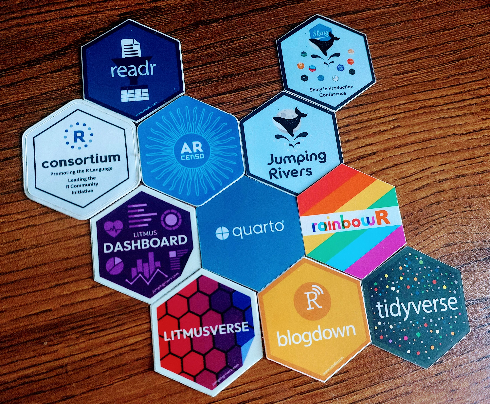
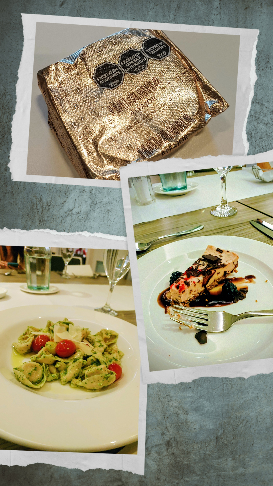

```{r setup, include=FALSE}
knitr::opts_chunk$set(echo = FALSE,
                      out.width = "100%",
                      out.extra="style='border:1px solid black;'")

```

I had the wonderful opportunity to attend the **R Dev Day @ RSECon25**, a full day dedicated to contributing to the R language. Held at the University of Warwick, Coventry, the event brought together R contributors from across the world, creating an inspiring environment to collaborate, contribute, code, and learn\!

## Preparing for Dev Day

Before the R Dev Day, we had an optional preparation day where participants could set up prerequisites and explore the list of issues in the [**r-devel/r-dev-day** **GitHub repository**](https://github.com/r-devel/r-dev-day)**.** The issues were thoughtfully categorised \- Translation, Statistics/Graphics/Documentation, I/O, Low-level, and Misc. This made it easier to pick something aligned with our interests and skills. This pre-meetup also helped us decide which issues we wanted to work on and ensured we arrived well-prepared.


## A Full Day of Contributions

During the Dev Day itself, I worked on two issues from the **r-devel** repository:

**Issue 1: Bug 18282 \- Improving the documentation of `var.test()`**  
I focused on enhancing the documentation of the R function `var.test()` along with the other contributors. I received helpful and constructive feedback from Sebastian Meyer, and by the end of the day, we were able to submit a patch for the issue. Seeing this progress come together collaboratively was extremely satisfying. Check out more about my contribution in [this GitHub issue](https://github.com/r-devel/r-dev-day/issues/45)\!

**Issue 2: Testing with 'write' permission**  
For my second issue, I was given `write` permissions in the repository. On my macOS machine, I set up and installed [pre-commit](https://pre-commit.com/) and successfully ran the R function `use_precommit()`. Pre-commit is a tool that helps one automatically check for minor issues before pushing code from a local repository to a remote repository for code review or for merging. This was a great hands-on experience that deepened my understanding of the technical workflow used in R development. Check out my contribution in [this GitHub issue](https://github.com/r-devel/r-dev-day/issues/122)\!

## Learning New Tools



One of the highlights of the day was learning how to use **GitHub Codespaces** and **Live Codespaces**. Live Codespaces makes real-time, collaborative coding feel as intuitive as working together on a shared document \- similar to a Google Doc but for code. This significantly speeds up development when working as a team.

## Connecting with the R Community

  

Throughout the event, I had the chance to work alongside R contributors from many parts of the world. It was wonderful to see how various R communities \- such as [**R-Ladies**](https://rladies.org/)**,** [**rOpenSci**](https://ropensci.org/), and [**rainbowR**](https://rainbowr.org/) \- collaborate, support each other, and help newcomers find their footing.

Meeting many members of the R-Ladies community in person was especially meaningful. R was my first programming language, and **R-Ladies Global** was the first open-source community I joined. I was warmly welcomed into the community early on and even got the opportunity to serve as a social media curator. This role introduced me to the wider world of open-source software and community-led development \- something that continues to enrich my career and learning journey.

## Some Lovely Memories!




Along with coding and collaborating, the day also brought small moments of joy \- collecting R stickers from different packages and communities, chocolates shared by the R en Buenos Aires chapter, and evening Dev Day dinners. 

## My gratitude!

This experience was both enriching and motivating. My heartfelt thanks to **Heather Turner** for inviting me, guiding us through the day, and bringing together such a vibrant and welcoming community of R contributors. I am truly grateful for the opportunity\!

## Get In Touch:

**Email:** [bhogaljyoti1@gmail.com](mailto:bhogaljyoti1@gmail.com)   
**LinkedIn:** [jyoti-bhogal](http://www.linkedin.com/in/jyoti-bhogal)  
**GitHub:** [jyoti-bhogal](https://github.com/jyoti-bhogal)   
**Mastodon:** [jyoti_bhogal](https://mastodon.social/@jyoti_bhogal)

**Bluesky:** [jyoti-bhogal.bsky.social](https://bsky.app/profile/jyoti-bhogal.bsky.social)

**Website:** https://jyoti-bhogal.github.io/about-me/index.html
