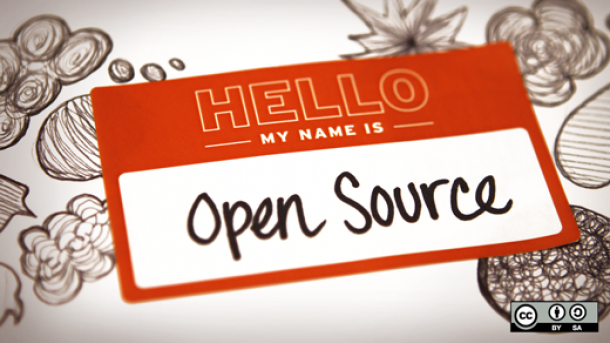
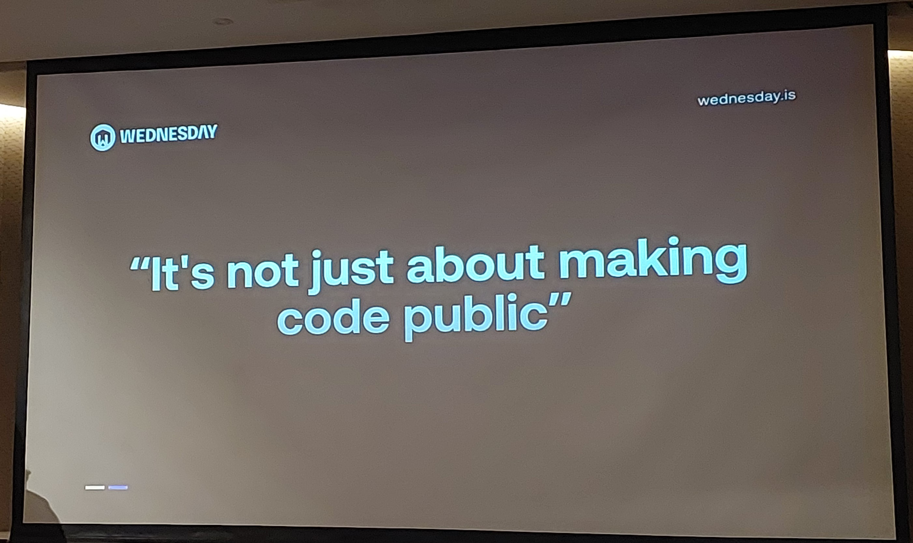
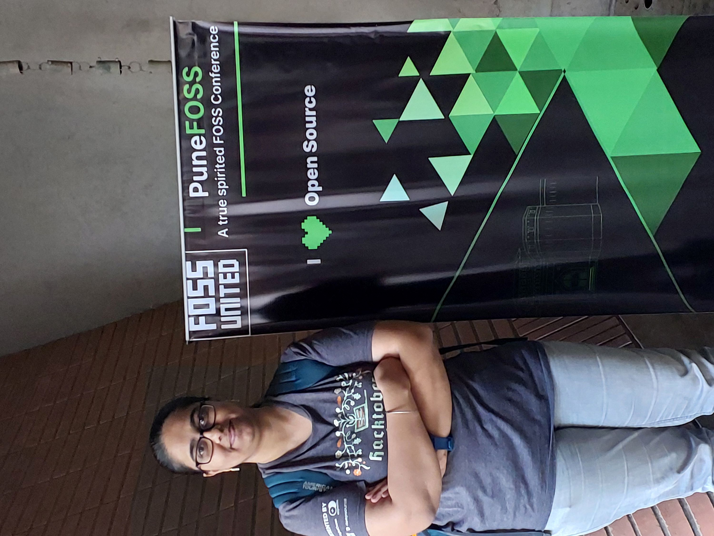

  
  
```{r setup, include=FALSE}
# ## FIGURE OUT why does this give error
```


## Introduction
Recently, I had the privilege of attending PuneFOSS 2.0, a one-day conference hosted by the FOSS United community at College of Engineering Pune, India on 24th Feb 2024. The conference had an impressive lineup of speakers, including industry experts like [Vishal Arya](https://www.linkedin.com/in/wisharya/), [Rahul Kulkarni](https://www.linkedin.com/in/rahul10100/), [Rohaan Goswami](https://www.linkedin.com/in/rohaangoswami/), [Faeka Ansari](https://www.linkedin.com/in/faeka/), [Mohammed Ali Chherwalla](https://www.linkedin.com/in/mohammed-ali-chherawalla/), [Pranay Narang](https://www.linkedin.com/in/pranay-narang/), [Praveen Kumar](https://www.linkedin.com/in/praveen-kumar-d-06b545168/), and [Siddharth Jha](https://www.linkedin.com/in/clearlysid/), culminating in a thought-provoking panel discussion. This blog highlights some key insights shared during the event.

## What is FOSS?
FOSS, an acronym for Free and Open Source Software, embodies a software development philosophy centered on freedom and openness. The term 'Free' denotes users' liberty to run, alter, and share the software, while 'Open Source' signifies that the software's source code is available for users to inspect, modify, and contribute to its progress. FOSS promotes collaboration, transparency, user empowerment, and frequently leads to the creation of more secure and sustainable software projects. Notable instances include Linux, Blender, Chromium, Kubernetes, and Mozilla Firefox.

## Why FOSS?
FOSS provides users with the liberty to utilize, adapt, and share software based on their preferences. This empowerment extends to both individuals and organizations, granting them control over their tools. The accessibility of the source code enables users to examine the inner workings of the software. FOSS promotes a collaborative model in software development, with a global community of diverse developers contributing to the creation of stronger, more secure, and innovative software. Users retain the freedom to tailor FOSS to meet their specific needs.





## Open Source in Government
Rahul Kulkarni shared his experiences through his talk on ‘How open source encounters shaped my career’. He highlighted that one should choose open source or enterprise solutions based on the problem to be solved. I particularly liked the insights he gave about the necessity of using open source solutions for building digital platforms to be used by the Government of a country for large scale initiatives which require reaching out to each and every citizen. For example, the digital systems of government issued identity cards in India for various purposes like the AADHAAR UIDAI system. The rationale for the same being that this approach reduces the vendor buy-in, and independence from the roadmaps & timelines of the Enterprise software companies. He explained the importance of Data Empowerment and Protection Architecture (DEPA), which is a secure consent-based data sharing framework to accelerate financial inclusion. Rahul highly recommeded the book ‘The Cathedral and the Bazaar’ by Eric S. Raymond, in which the author explores the contrasting approaches of closed, centralized development (the cathedral) and open, decentralized collaboration (the bazaar) in the world of software development.

## Roadmap to Contribute to Open Source content and community
In an impressive talk on ‘Noobernetes assembly! Sneak Peek into one of the largest Open Source project’, Faeka Ansari provided a comprehensive walkthrough on starting a journey into open source contribution in Kubernetes and growing on the pathway. Drawing from her own experiences, she detailed the contribution pathway and shared valuable insights gained from working with the global Kubernetes community.

## FOSS for Social Impact
Rohaan Goswami shared his lived experiences around entrepreneurship focusing on the topic ‘Human Centered Technology: Field Notes & Stories of Social Innovation using FOSS in 10+ countries’. Rohaan spoke about the human-centric approach taken towards health tech by his organization YCenter in Africa and India. He also shared the lessons he learnt from working on global projects as diverse as using AI to help Governments make better policy decisions in Africa, developing patient-centric innovations in HPV prevention & cancer care in Southeast Asian countries and creating agritech innovations to support farmers.

## Panel Discussion Highlights
The panel discussion delved into critical questions, such as the interpretation of 'Free' - whether in terms of usage or freedom of development. Panelists, including Rahul, Rohaan, Nikhil, and Chakshu, provided diverse perspectives. Nikhil emphasized the government's reliance on open source for large-scale projects, while Chakshu highlighted the importance of open source documentation as a valuable learning resource.

## Addressing Disparity in Github Accounts vs Contributors
One significant challenge discussed was the vast difference between the number of Github accounts and active contributors in India. The panel suggested initiatives like Code4GovtTech as a countrywide Indian alternative to the global GSoC, and highlighted the role of Consent Manager in India, encouraging attendees to explore its documentation for further insights.




## Conclusion
PuneFOSS 2.0 was a melting pot of ideas, experiences, and discussions surrounding the open source community.The event not only showcased the diversity of expertise but also addressed pertinent issues, fostering a collaborative spirit in the pursuit of advancing open source initiatives in India. Check out [this page](https://indiafoss.net/Pune/2024) to know more details of event or watch the [livestream here](https://www.youtube.com/watch?v=IkqRx2Bkuyk).

I had a day full of intriguing discussions with the speakers regsarding problem solving and creating impact in daily life of the user being at the core of any project, and the tools being secondary. The event reinforced my belief in the power of community!

What are your thoughts and experiences around the open source philosophy? Leave them in the comments or write back to me at bhogaljyoti1@gmail.com; I am happy to read and reply!