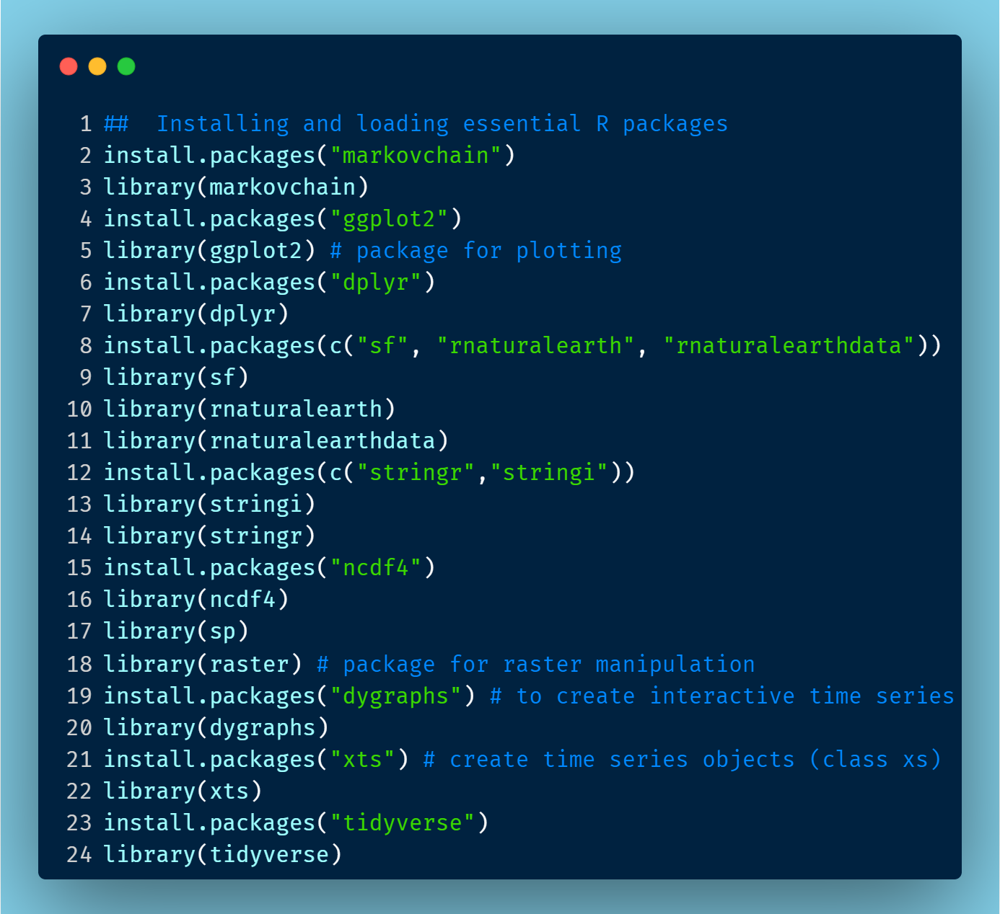
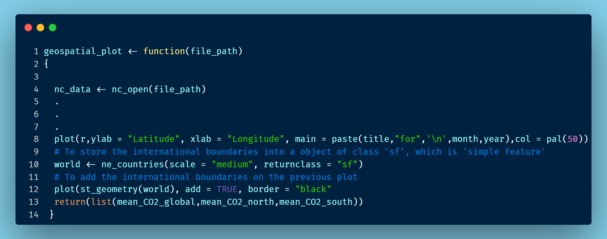
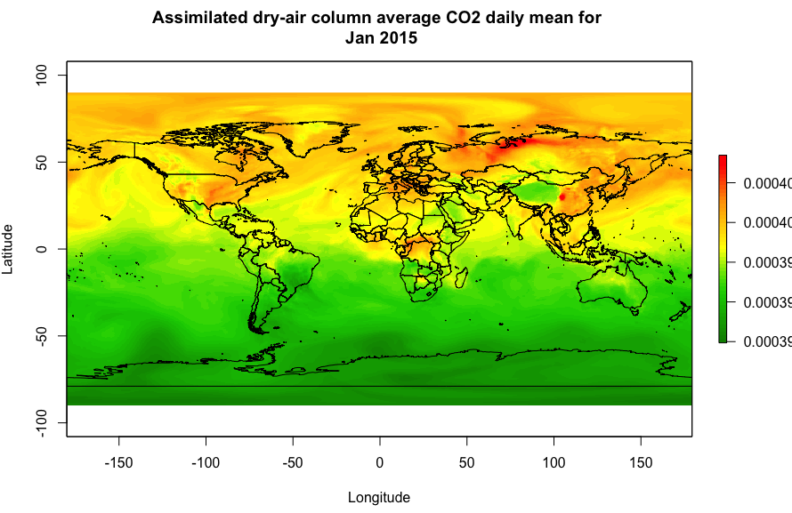
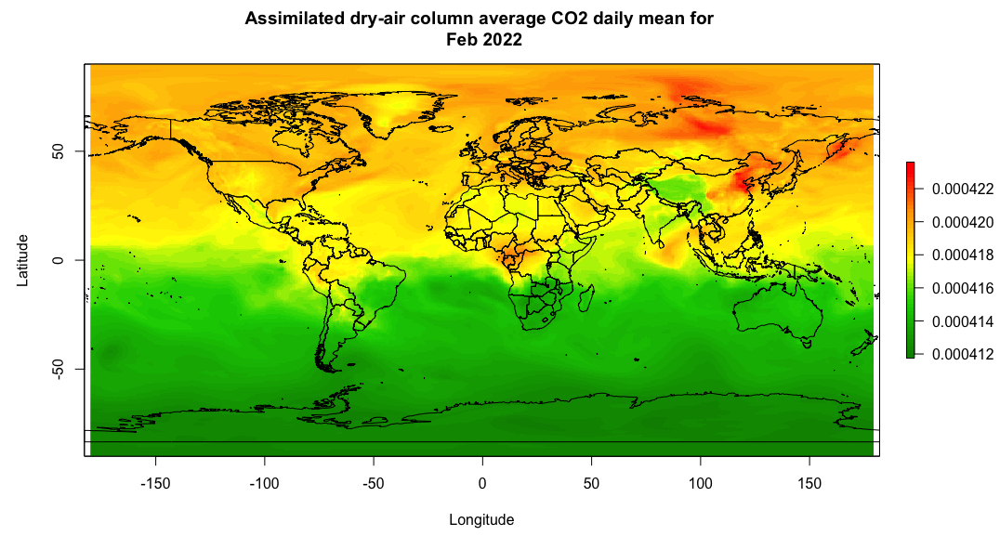

```{r setup, include=FALSE}
knitr::opts_chunk$set(echo = FALSE,
                      out.width = "100%",
                      out.extra="style='border:1px solid black;'")

```

```{r}
knitr::include_graphics("banner_climate_action.jpg")
```

 
## Introduction
To foster a sustainable lifestyle globally, the United Nations has established the Sustainable Development Goals (SDGs), a comprehensive framework consisting of 17 targets set to be achieved by 2030. Each goal is accompanied by specific indicators crucial for determining progress and success.

## Goal 13: Climate Action
Within this framework, Goal 13: Climate Action emerges as a pivotal objective for urgently addressing climate change and its far-reaching impacts. Goal 13 is gauged through two vital indicators:

1. The number of countries reporting nationally determined contributions, long-term strategies, national adaptation plans, and adaptation communications to the United Nations Framework Convention on Climate Change secretariat.

2. Total greenhouse gas (GHG) emissions per year.

### Focus on Indicator 2
This blog post centers its analysis on Indicator 2, delving into the critical assessment of total GHG emissions per year.

### Greenhouse Gases Overview
The primary greenhouse gases (GHGs) encompass carbon dioxide (CO~2~), methane, nitrous oxide, ozone, chlorofluorocarbons, and water vapour. With CO~2~ constituting approximately 76% of total GHGs (Source: [Inventory of U.S. Greenhouse Gas Emissions and Sinks 1990-2015, EPA, 2017](https://www.epa.gov/ghgemissions/inventory-us-greenhouse-gas-emissions-and-sinks)), my analysis will hone in on the dynamics of carbon dioxide.

## Data Source and Collection
For this analysis, I leveraged the NASA Earth Observation data, a publicly accessible resource catering to a diverse audience, including students, citizen scientists, researchers, academicians, and industries. Using Terminal commands, I downloaded 2616 data files. Each of these files represents a day from January 1, 2015, to February 28, 2022. These files store records of the Assimilated Dry-Air Column Average CO~2~ Daily Mean, indexed by latitude and longitude, and are formatted in a .netCDF file. The data download steps drew inspiration from a comprehensive [Medium article by Haolin Xiong](https://medium.com/@xhl272703370/tutorial-on-how-to-download-multiple-earthdata-urls-78c96df4c1c7).

## Data Analysis in RStudio
We used the 2616 .netCDF files, one file representing one day. Each file has the daily average value of CO2 stored in grid points formed by the 576 longitude and 361 latitude points. We extracted the data for CO2 present in the form of a matrix of dimension 576 rows and 361 columns. From this matrix, we computed the global average, global north average, and global south average value of CO2, for each day. Thus we created three different time series for these average values from 1 Jan 2015 to 28 Feb 2022. To go a step ahead, we  also converted the CO2 gridded data into a raster object to create a world map.






### Data Plotting:
To create interactive time series plots in R, we used the ‘dygraph’ package. The interactive plot is such that, when the user points the cursor on the plot area, they can see the (x,y) coordinates, which are the date and average values from the three time series, respectively. The plot also has a time range selector at the bottom, using which the user can zoom in to see the time series values for a particular time period of interest. Besides, we used the raster object to look at the daily values of CO2 in each geographical region. Two such plots are given below. The working code is accessible from the [Github repository jyoti-bhogal/data_visualisation](https://github.com/jyoti-bhogal/data_visualization/blob/main/Geospatial_plot_function.R). 


## Visualising CO~2~ Changes
The resultant maps offer a vivid representation of the evolving values of the Assimilated Dry-Air Column Average CO~2~ Daily Mean. These visual cues paint a detailed picture of how CO~2~ emissions have dynamically evolved across diverse geographical regions. Please look closely at the numerical range in the index at the right of the graphs. Notice how the average value changes from ~390 ppm in 2015 to ~418 ppm in 2022.


<iframe width="560" height="315" src="https://www.youtube.com/embed/4ShS9WI-gic?si=a90oUEi1MNf60GfM" title="YouTube video player" frameborder="0" allow="accelerometer; autoplay; clipboard-write; encrypted-media; gyroscope; picture-in-picture; web-share" allowfullscreen></iframe>







## Goal 13 and Future Targets
The Goal 13 of SDGs envisions a 43% reduction in GHG emissions by 2030 starting from 2010, culminating in net-zero emissions by 2050. The above graphs as well as sources reveal CO~2~ levels of approximately 390 ppm in 2010 and 419 ppm in 2023 (Source: [Carbon Dioxide | Vital Signs – Climate Change](https://climate.nasa.gov/vital-signs/carbon-dioxide/#:~:text=Although%20total%20CO2%20is,photosynthesis%20on%20a%20massive%20scale.)),i.e., a 7.5% increase as opposed to the 43% targeted decrease. Indicator 2, reflecting on total GHG emissions, seems to fall short of anticipated targets. Addressing this shortfall requires not only governmental policies but also individual contributions. Transitioning to green fuel vehicles, re-assessing agricultural practices like Stubble burning, increasing vegetation cover, and embracing recycling and reuse initiatives stand as actionable steps towards a sustainable future.


## Some Fun Insight:  Seasonal Fluctuations
Diving into the intricacies of annual CO~2~ fluctuations, we uncover the profound impact of seasonal cycles in photosynthesis. From the Northern Hemisphere spring, where plant growth absorbs CO~2~, to the autumn, marked by plant decomposition releasing CO~2~, a symphony of natural processes influences atmospheric CO~2~ levels. A parallel, albeit milder, pattern plays out in the Southern Hemisphere during opposing seasons.


<iframe width="560" height="315" src="https://www.youtube.com/embed/Jtxx52XOx7I?si=wOEqck4N_nilDQdO" title="YouTube video player" frameborder="0" allow="accelerometer; autoplay; clipboard-write; encrypted-media; gyroscope; picture-in-picture; web-share" allowfullscreen></iframe>


 