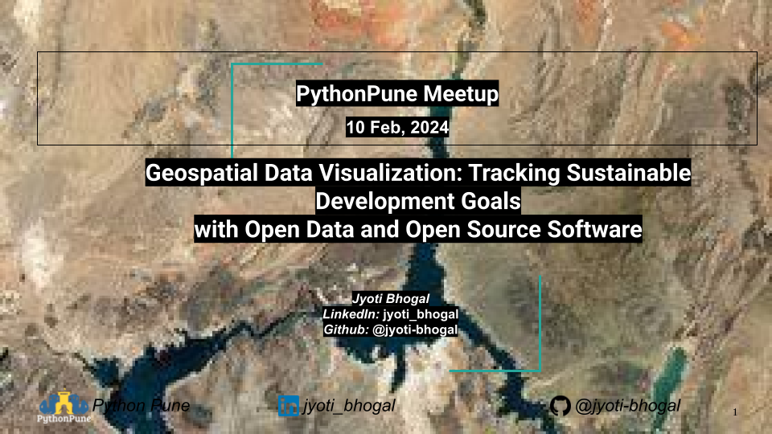

  
  
```{r setup, include=FALSE}
knitr::opts_chunk$set(echo = FALSE,
                      out.width = "100%",
                      out.extra="style='border:1px solid black;'")
```



🔑 **Talk Resources:** 

1. **Slides:** Bhogal, J. (2024, March 10). Geospatial Data Visualization: Tracking Sustainable Development Goals with Open Data and Open Source Software. Zenodo. https://doi.org/10.5281/zenodo.15211927 
