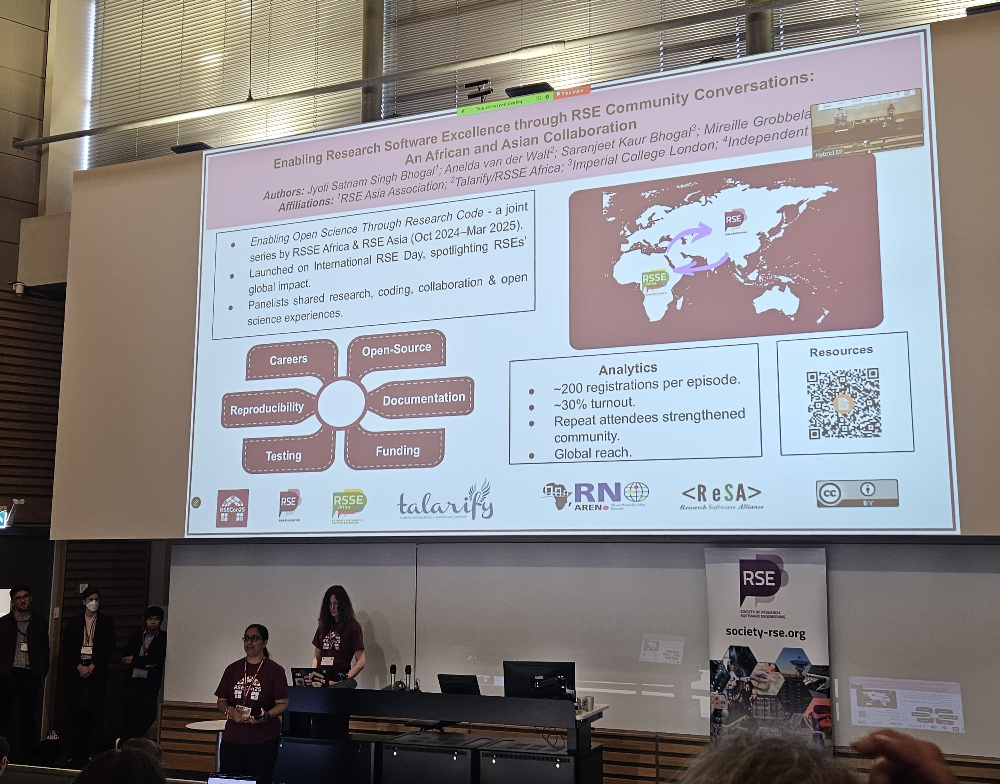

  
  
```{r setup, include=FALSE}
knitr::opts_chunk$set(echo = FALSE,
                      out.width = "100%",
                      out.extra="style='border:1px solid black;'")
```



🔑 **Talk Resources:** 

1. **Slides:** Bhogal, J. (2025, September 9). Enabling Research Software Excellence through RSE Community Conversations: An African and Asian Collaboration. Zenodo. https://doi.org/10.5281/zenodo.17289246

2. **Recording:** Coming soon!

3. **Featured Blog:** Coming soon!
