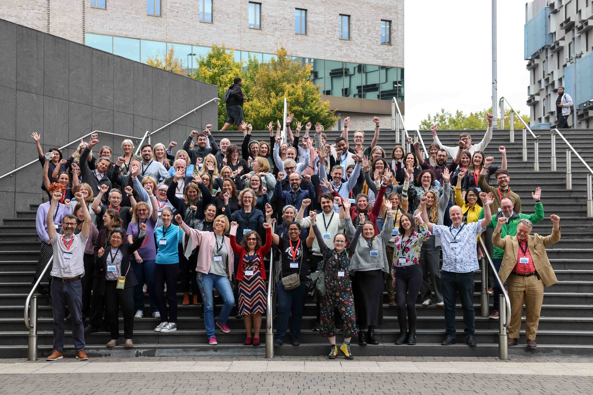

  
  
```{r setup, include=FALSE}
knitr::opts_chunk$set(echo = FALSE,
                      out.width = "100%",
                      out.extra="style='border:1px solid black;'")
```



🔑 **Talk Resources:** 

1. **Slides:** Bhogal, J. (2025, September 27). Drawing Parallels: A Unicorn Mandala Art Workshop on Open Data & Collaborations. Zenodo. https://doi.org/10.5281/zenodo.17260657

2. **Recording:** [YouTube recording](https://youtu.be/EQ_Add2dEPw?list=PLd9IowK2Ms3RCT1LBh0H0vysXvmdwvgyT&t=3492)

3. **Featured Blog:** Coming soon!
